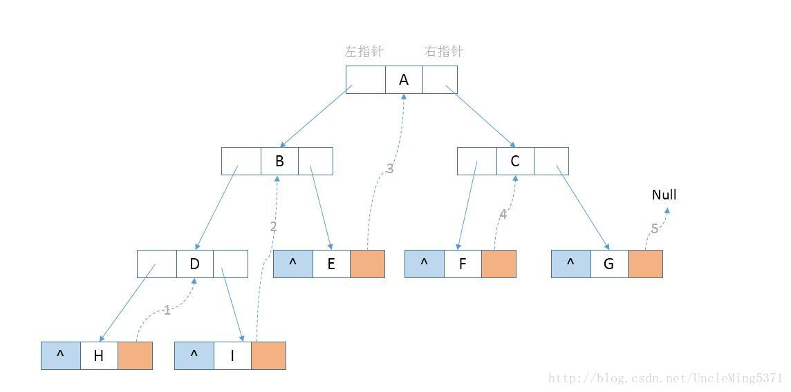
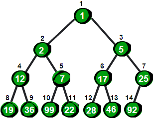
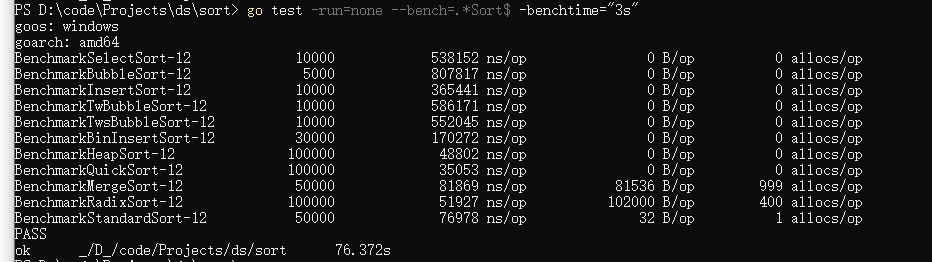
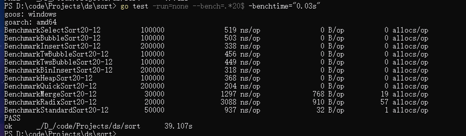
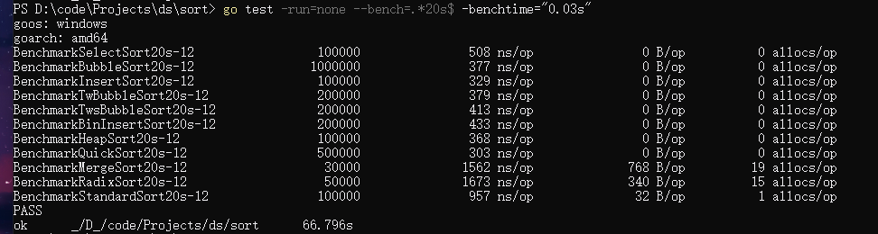
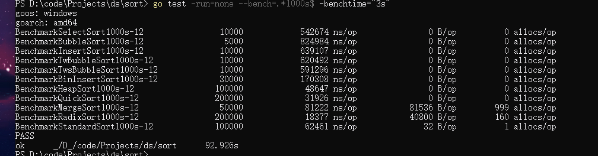

[TOC]


# 数据结构与算法分析：Go语言描述

手头正好有一本书，《数据结构与算法分析：c++语言描述》，当年学数据结构的时候，真的完全没花心思进去，学出来跟没学一样，所以现在准备重学。

那些数据结构，全部用go语言重新实现一遍。正好go语言里面其实也没有这方面的标准库，写完了，可以作为一个自己的库使用。


前五章，200多页内容都是讲c++的语法，面向对象之类的。第6章开始才是抽象数据结构。所以前面的内容暂且不看。

因为原书是c++语言的，所以我干脆先用c++实现一遍？毕竟大部分很大部分内容都是c++相关。

可以先c++看书实现一遍，然后go语言不看书实现一遍。

试了一下还是放弃了，我再次感受到以前学习c++时的痛苦，从头到尾把前面5章概览了一边，c++繁多的特性，再次出现在我的脑海中。首先是语法繁琐，代码分为.h头文件和cpp文件，函数声明和定义加起来要写两遍。

其次是ide不好用，vs智能提示很弱，配置麻烦（我不会配置啊，正常不应该开箱即用吗），还有各种莫名其妙的编译器错误

搞了半天把第一个基于静态数组的列表实现并测试完，我就想放弃了。垃圾回收的部分还没写过，不过应该也是比较繁琐的。

所以说直接用golang实现吧。

## 1.列表

### 01.用切片slice设计一个ArrayList

go 语言里面，其实这么搞没有太大必要，因为slice本来功能已经足够强大了。这边优势是，元素类型用interface{}，所以各种类型都可以放进去。

```go
// Package arraylist 基于go的基础类型切片封装一个arraylist
package arraylist

import "fmt"

// ListType 用来确定元素类型,interface{}类型可以接受各种类型
type ListType interface{}

const (
	// INITCAP 初始容量
	INITCAP = 10
)

// ArrayList 基于go切片类型设计的列表
type ArrayList struct {
	list []ListType
	len  int //元素个数
	cap  int //底层切片容量大小
}

// Init ArrayList的初始化方法，列表初始化大小为10
func (a *ArrayList) Init() *ArrayList {
	a.list = make([]ListType, INITCAP)
	a.cap = INITCAP
	a.len = 0
	return a
}

// New 相当于一个工厂方法，调用这个方法，直接返回一个初始化好的ArrayList指针
func New() *ArrayList {
	list := new(ArrayList)
	return list.Init()
}

// GetLen 获取ArrayList当前的元素个数
func (a *ArrayList) GetLen() int {
	return a.len

}

func (a *ArrayList) expandCap() {
	a.cap *= 2
	// 创建一个新的切片，每次容量变为两倍
	newist := make([]ListType, a.cap)
	// 将旧list数据全部拷贝到新list
	copy(newist[:a.len], a.list[:a.len])

	a.list = newist
}

// Append 在ArrayList列表尾部添加一个元素
// 如果列表容量不够，则会扩容到两倍，并把数据拷贝过去
func (a *ArrayList) Append(item ListType) {
	if a.len == a.cap {
		a.expandCap()
		a.list[a.len] = item
		a.len++
	} else {
		a.list[a.len] = item
		a.len++
	}
}

// Push 在ArrayList列表尾部添加一个元素，使用Append的实现
func (a *ArrayList) Push(item ListType) {
	a.Append(item)
}

// Pop 返回列表最后一个元素，列表长度减一
func (a *ArrayList) Pop() ListType {
	if a.len == 0 {
		panic("pop error , no element in the list")
	}
	a.len--
	return a.list[a.len]
}

// Empty 判断ArrayList里的列表是否为空
func (a *ArrayList) Empty() bool {
	if a.len == 0 {
		return true
	}
	return false
}

// Insert 在指定位置pos，插入一个数据 item
// 也可以支持在后面插入，相当于实现Append的功能
// 如果给出一个超出范围的数字，会触发panic
func (a *ArrayList) Insert(item ListType, pos int) {
	if a.len == a.cap {
		a.expandCap()
	}
	if pos < 0 || pos > a.len {
		panic("insert error, pos is out of range")
	}
	for i := a.len; i > pos; i-- {
		a.list[i] = a.list[i-1]
	}
	a.list[pos] = item
	a.len++
}

// Erase 擦除指定位置pos的数据
func (a *ArrayList) Erase(pos int) {
	if pos < 0 || pos > a.len {
		panic("erase error , pos is out of range ")
	}
	for i := pos; i < a.len; i++ {
		a.list[i] = a.list[i+1]
	}
	a.len--
}

// Show 将列表打印输出
func (a *ArrayList) Show() {
	for i := 0; i < a.len; i++ {
		fmt.Print(a.list[i], " ")
	}
	fmt.Println()
}

```


### 02.简单链表

在arraylist中元素被排列成一个线性序列，当添加的数据量达到容量值的时候，要进行拷贝。

插入的时候也会进行频繁的位移和拷贝，导致效率低下。

链表是由成为节点的元素组成的序列，其中每个元素包括两部分，

1. data存放列表的一个元素
2. next，存放一个指针，指出下一个列表元素的节点的位置，如果没有下一个元素，将用一个特殊的nil值

另外，我们需要记录第一个节点的位置，这样我们可以通过这个节点不断向后遍历到链表的所有节点。


列表基本操作

1. 构造（Construction）

为了构造一个空列表，我们只需简单地把first设为空指针，就可以判断出列表是否为空。

2. 判空(Empty)

判断first是否为空，就可以判断出列表是否为空。

3. 遍历（Traverse）

遍历列表

4. 插入（Insertion）
5. 删除（Deletion）


基于go语言的实现

```go
package linklist

import "fmt"

// Node 单链表的节点
type Node struct {
	Element interface{}
	Next    *Node
}

// LinkList 单链表类的结构体
type LinkList struct {
	Head *Node
	len  int
}

// Init 初始化linklist或者清空linklist
func (l *LinkList) Init() *LinkList {
	l.Head = nil
	l.len = 0
	return l
}

// New 返回一个初始化的linklist
func New() *LinkList {
	return new(LinkList).Init()
}

// Empty 通过头节点是否为空判断linklist是否为空
func (l *LinkList) Empty() bool {
	if l.Head == nil {
		return true
	}
	return false
}

// Len 获取linklist的节点数目
func (l *LinkList) Len() int { return l.len }

// Insert 插入某个值，在at节点的后面
func (l *LinkList) Insert(val interface{}, at *Node) {
	at.Next.Element = val
	l.len++
}

// Append 添加元素在链表的尾部
func (l *LinkList) Append(val interface{}) {
	if l.Empty() {
		l.Head = &Node{val, nil}
	} else {
		tmp := l.Head
		for tmp.Next != nil {
			tmp = tmp.Next
		}
		tmp.Next = &Node{val, nil}
	}
	l.len++
}

// Remove 移除linklist的某个节点
func (l *LinkList) Remove(at *Node) {
	if at == nil {
		return
	}
	if at == l.Head {
		l.Head = l.Head.Next
	} else {
		tmp := l.Head
		for tmp.Next != nil {
			if tmp.Next == at {
				tmp.Next = at.Next
			}
		}
	}
	l.len--
}

// Traversal 遍历单链表
func (l *LinkList) Traversal() {
	tmp := l.Head
	fmt.Print(tmp.Element)
	for tmp.Next != nil {
		tmp = tmp.Next
		fmt.Print(",", tmp.Element)
	}
	fmt.Println()
}

```


以上是一个简单链表，除此之外，还有很多变种：循环链表，双向链表，带头结点的链表等


基于数组实现链表，我们也可以不适用指针，使用下标来表示下一个节点的位置，实现基于数组的链表。

### 03.带头节点的链表

带头节点的链表，好处在于所有的节点都有前驱，可以简化一部分插入和删除操作。


### 04.循环链表

循环链表是一个环状结构，链表的最后一个节点，和头节点相连。


### 05.双向链表

对比单向链表，多了一个prev节点，使得可以方便地从两个方向进行遍历

为了方便遍历的进行，指针 first 和指针last分别指向第一个节点和最后一个节点

C++中的标准list正是使用双向链表来实现

go 的标准库 container/list 也是双向链表实现的


## 2.栈

### 01.基于线性表的栈

栈是一种LIFO（LAST IN FIRST OUT 后进先出）的数据结构

基本操作

1. 创建一个栈
2. 检查栈是否为空
3. push
4. pop
5. top：返回栈顶元素

基于go slice实现的栈

```go
package stack

import (
	"fmt"
)

const (
	// INITCAP 初始容量
	INITCAP = 10
)

// Stack 栈类的结构体
// cap为底层list的容量，top表示栈顶下标，同时也是栈的元素个数
type Stack struct {
	list []interface{}
	cap  int
	top  int
}

// Init 初始化栈类，或者清空栈类
func (s *Stack) Init() *Stack {
	s.list = make([]interface{}, INITCAP)
	s.cap = INITCAP
	s.top = 0
	return s
}

// New 返回一个初始化好的栈
func New() *Stack {
	return new(Stack).Init()
}

// Empty 通过判断栈顶下标的位置是否为0，判断栈是否为空
func (s *Stack) Empty() bool {
	if s.top == 0 {
		return true
	}
	return false
}

// 当栈类里面的数组容量不够时，调用这个方法扩容到两倍，原来的数据也会拷贝过去
func (s *Stack) expandCap() {
	s.cap *= 2
	// 创建一个新的切片，每次容量变为两倍
	newist := make([]interface{}, s.cap)
	// 将旧list数据全部拷贝到新list
	copy(newist[:s.top], s.list[:s.top])
	s.list = newist
}

// Push 添加元素到栈尾
func (s *Stack) Push(val interface{}) {
	if s.top == s.cap {
		s.expandCap()
	}
	s.list[s.top] = val
	s.top++
}

// Pop 删除栈顶的一个元素并返回，没有添加错误处理，执行这个操作是要先判断栈是否为空
func (s *Stack) Pop() interface{} {
	s.top--
	return s.list[s.top]
}

// Top 返回栈顶的元素，如果栈为空，返回nil
func (s *Stack) Top() interface{} {
	if s.top == 0 {
		return nil
	}
	return s.list[s.top-1]
}

// Display 输出栈中的所有元素，栈底到栈顶，从左到右
func (s *Stack) Display() {
	for i := 0; i < s.top; i++ {
		fmt.Print(s.list[i], " ")
	}
	fmt.Println()
}

```

### 02.链式栈

链式栈不需要扩充底层数组扩容，可以充分利用存储空间。

链式栈go语言实现

```go
package linkstack

import "fmt"

// node 链式栈的节点
type node struct {
	value interface{}
	next  *node
}

// LinkStack 链式栈的结构体
type LinkStack struct {
	top *node
	len int
}

// Init 初始化链栈，或者情况链栈
func (l *LinkStack) Init() *LinkStack {
	l.top = nil
	l.len = 0
	return l
}

// New 返回一个初始化好的链栈
func New() *LinkStack {
	return new(LinkStack).Init()
}

// Empty 通过判断链栈顶部节点是否为nil，判断链栈是否为空栈
func (l *LinkStack) Empty() bool {
	if l.top == nil {
		return true
	}
	return false
}

// Top 返回链栈顶部节点的值
func (l *LinkStack) Top() interface{} {
	return l.top.value
}

// Push 在链栈的尾部添加元素
func (l *LinkStack) Push(val interface{}) {
	if l.top == nil {
		l.top = &node{val, nil}
	} else {
		newNode := &node{val, nil}
		newNode.next = l.top
		l.top = newNode
	}
	l.len++
}

// Pop 删除链栈顶部节点，并返回那个节点的值
func (l *LinkStack) Pop() interface{} {
	if l.top == nil {
		panic("error,no nodes in this linkstack")
	}
	topVal := l.top.value
	l.top = l.top.next
	l.len--
	return topVal

}

// Display 输出链栈的所有元素，从顶部到底部，从左到右
func (l *LinkStack) Display() {
	for l.top.next != nil {
		fmt.Print(l.top.value, " ")
		l.top = l.top.next
	}
	fmt.Println()
}

```


## 3.队列

队列是一种FIFO（FIRST IN FIRST OUT 先进先出）的数据结构

由于数组型队列浪费空间比较严重，所以不选择实现了。


### 01.链式队列

链式队列的go语言实现，基于单链表

```go
package queue

import "fmt"

// 链式队列节点
type node struct {
	element interface{}
	next    *node
}

// Queue 链式队列的结构体
type Queue struct {
	front *node
	back  *node
	len   int
}

// Init 初始化队列或者清空队列
func (q *Queue) Init() *Queue {
	q.front = nil
	q.back = nil
	q.len = 0
	return q
}

// New 获得一个初始化好的Queue
func New() *Queue {
	return new(Queue).Init()
}

// Empty 通过链式队列的元素个数len，判断队列是否为空
func (q *Queue) Empty() bool {
	if q.len == 0 {
		return true
	}
	return false
}

// Enqueue 在队列尾部添加一个元素，如果队列为空，则队列头部和尾部都会等于这个新节点
func (q *Queue) Enqueue(val interface{}) {
	if q.Empty() {
		q.back = &node{val, nil}
		q.front = q.back
		q.len++
	} else {
		tmp := q.front
		for tmp.next != nil {
			tmp = tmp.next
		}
		tmp.next = &node{val, nil}
		q.back = tmp.next
		q.len++
	}
}

// Front 返回队列前端节点，没有判空逻辑，所以队列不为空时才能使用
func (q *Queue) Front() interface{} {
	return q.front.element
}

// Back 返回队列后端节点，没有判空逻辑，所以队列不为空时才能使用
func (q *Queue) Back() interface{} {
	return q.back.element
}

// Dequeue 删除队列前部节点，并返回值，如果队列为空，返回nil
func (q *Queue) Dequeue() interface{} {
	if q.Empty() {
		return nil
	}
	val := q.front.element
	q.front = q.front.next
	if q.len == 1 {
		q.back = nil
	}
	q.len--
	return val
}

// Display  输出队列中的元素
func (q *Queue) Display() {
	tmp := q.front
	for tmp != nil {
		fmt.Print(tmp.element, " ")
		tmp = tmp.next
	}
	fmt.Println()
}
```


## 4.二叉树和散列表

### 01.二叉树概念

首先我们把目光聚焦到 二分查找上。

对于一个有序的序列，二分查找，的效率为O(log n)，查找效率极高。

但是对于一般的链表，无法通过下标索引进行访问，定位中间元素，需要遍历该元素之前的所有元素。

对于链表这样的链式结构，我们把第一个二分查找的中间节点作为根节点，第二次两个二分查找可能的中点作为第二层节点。。。

最终就形成了一个树状结构，这种结构就可以方便地进行二分查找，被称为二分查找树。二叉查找树


子女 双亲 祖先 兄弟等容易理解的概念。。。

二叉树是树中的一种特例，即每个节点最多有两个子节点。

完全二叉树，除了最下层叶节点，每个节点都有两个子节点

非完全二叉树，除了叶节点，有的节点不足两个子节点


### 02.二叉树的数组表示

数组可以用来存储二叉树，

比如按从上到下从左到右的顺序放入数组。

适用于完全树的存储。

如果是非完全树，显然要空出很多节点，每一层的节点数分别为 2^(n-1)，由于是指数增长，浪费空间会很严重


### 03.二叉树的链表表示

为了更有效地使用空间并提供额外的灵活性，通常使用链表来实现二叉树

每个节点除了本节点的数据，还具有一个left和一个right指针，分别指向左子节点和右子节点


二叉树可以很自然地定义为递归数据结构

二叉树的三种遍历方式

LVR: 中序遍历方式 先遍历左子节点，再遍历父节点，再遍历右子节点

VLR: 前序遍历方式 先遍历父节点，再遍历左子节点，再遍历右子节点

LRV: 后序遍历方式  先遍历左子节点，再遍历右子节点，再遍历父节点


### 04.二叉查找树BST的实现

二叉查找树的性质：每个节点的值，比左子节点的值大，同时比右子节点的值小。

这种二叉树，可以方便地使用二分查找算法

基本操作

* 构造控的BST
* 判断BST是否为空
* 在BST中查找给定项
* 插入一项到BST中，并保持BST的性质
* 删除BST中的一项，并保持BST的性质
* 遍历BST，每个节点都要访问一次，多种遍历方法


无论查找，插入还是删除，都比较容易通过递归的方式实现


其中删除的操作稍微有些复杂

首先判断要删除的节点是不是头节点

因为头节点有一个特殊的地方就是没有父母节点，所以不像其他节点，需要改变父母节点的指针指向

我们先讨论删除的节点node不是头节点的情况，总共三种情况

1. 要删除的节点node是一个叶子节点

2. node有一个子女节点

3. node有两个子女节点

如果是第一种情况，很明显，我们只要把node父节点的指向node的指针设为空

如果是2，我们只需要把node父节点相应的指针指向node仅有的那个子女节点

无论node是左右节点都没关系，因为根据BST的性质，这样接上去大小都是符合的。

比如，如果node是父节点的右节点，那么node子树下面的节点必定都比node大

如果是第三种情况。

我们可以把node节点右边子树最小的节点赋值给他再执行删除，删掉那个最小的节点

也可以吧node左边子树最大的节点赋值给他，再删除那个节点

总之就是需要找这么一个节点，大小最接近原来的node，同时满足大于node的左子节点，小于node的右子节点。

也就是我上面说的那两个节点。


go 语言实现，基本上所有的查找，遍历都使用了递归操作

```go
//Package bst 二叉查找树的实现
package bst

import "fmt"

// 因为interface比较大小的时候需要确定类型，而且需要类型一致，valueType用于存储interface{}的类型方便修改
type valueType int

// BinNode 二叉查找树的节点
type BinNode struct {
	value int
	left  *BinNode
	right *BinNode
	// root用于表示节点属于哪个BST实例，删除的时候用于判断
	// root *BST
}

// BST 二叉查找树的结构体
type BST struct {
	root *BinNode
	len  int
}

// Init 二叉查找树BST的初始化，或者清空BST
func (b *BST) Init() *BST {
	b.root = nil
	b.len = 0
	return b
}

// New 返回一个初始化好的BST
func New() *BST {
	return new(BST).Init()
}

// Empty 通过判断根节点是否为nil，判断二叉树是否为空
func (b *BST) Empty() bool {
	if b.root == nil {
		return true
	}
	return false
}

// 由于不同interface{}的比较没有合适的方法，所以取消interface{} 用固定类型
// 感觉要做的话要先用type-switch判断类型，然后进行类型转换再比较，就算真的实现，性能损失也很大，不如直接用固定类型
// 还有一个问题是go 中type定义的类型，比如  type kkk int 和int不是同一个类型这样的设定。
// 比较两个interface接口的大小，过程中会先进行类型断言，再报错，如果出错，会触发panic
// 大于的情况，返回1，小于的情况返回-1，相等返回0
/*func compareInterface(v1 interface{}, v2 interface{}) int {
	v1t := v1.(type)
	v2t := v2.(type)
	if v1t != v2t {
		panic("v1 and v2 is different type")
	}
	if v1t(v1) > v2t(v2) {
		return -1
	} else if v1t(v1) < v2t(v2) {
		return 1
	} else {
		return 0
	}
}*/

// insert 插入一个节点进入二叉查找树
// 如果二叉树原本为空树，那么根节点用这个节点替换，否则插入到合适位置
// 插入需要满足二叉查找树的性质,每个节点的值比左子女大,比右子女小
// 因为要支持相同大小的元素,所以我这边实现如果一个插入节点的值大于等于节点的值,那么放右边.
// 毕竟相同元素也不会影响搜索，只是如果要搜索到全部的相同元素，需要搜一个删一个
func insert(node *BinNode, at *BinNode) {
	/*
		if compareInterface(node.value, at.value) == -1 {
			if at.left
			insert(node, at.left)
		} else {
			insert(node, at.right)
		}*/
	if at.left == nil && node.value < at.value {
		at.left = &BinNode{value: node.value, left: nil, right: nil}
		return
	}
	if at.right == nil && node.value >= at.value {
		at.right = &BinNode{value: node.value, left: nil, right: nil}
		return
	}

	if node.value < at.value {
		insert(node, at.left)
	} else {
		insert(node, at.right)
	}

}

func (b *BST) insert(node *BinNode) {
	if b.Empty() {
		b.root = node
	} else {
		insert(node, b.root)
	}
	b.len++
}

// 插入一个指定值到BST中，是对b.insert(&BinNode{value: v, left: nil, right: nil})的封装
func (b *BST) insertValue(v int) {
	b.insert(&BinNode{value: v, left: nil, right: nil})
	b.len++
}

// Add 添加一个值到BST
func (b *BST) Add(v int) {
	b.insertValue(v)
}

// 辅助进行递归操作的函数
func search(node *BinNode, v int) *BinNode {

	if node == nil || node.value == v {
		return node
	}
	if s1 := search(node.left, v); s1 != nil {
		return s1
	}
	if s2 := search(node.right, v); s2 != nil {
		return s2
	}
	return nil
}

// Search 返回值等于v的节点
// 如果没有找到，返回空
func (b *BST) Search(v int) *BinNode {
	if b.Empty() {
		return nil
	}
	return search(b.root, v)
}

// 用于递归调用函数，打印当前节点的值
// 字符串order指定遍历使用的顺序
func traverse(node *BinNode, order string) {
	switch order {
	case "LVR":
		if node != nil {
			traverse(node.left, "LVR")
			fmt.Print(node.value, " ")
			traverse(node.right, "LVR")
		}

	case "VLR":
		if node != nil {
			fmt.Print(node.value, " ")
			traverse(node.left, "VLR")
			traverse(node.right, "VLR")
		}
	case "LRV":
		if node != nil {
			traverse(node.left, "LRV")
			traverse(node.right, "LRV")
			fmt.Print(node.value, " ")
		}
	}
}

// TraverseMid  中序遍历二叉查找树
func (b *BST) TraverseMid() {
	traverse(b.root, "LVR")
	fmt.Println()
}

// TraverseFront 前序遍历二叉查找树
func (b *BST) TraverseFront() {
	traverse(b.root, "VLR")
	fmt.Println()
}

// TraverseBack 后序遍历二叉查找树
func (b *BST) TraverseBack() {
	traverse(b.root, "LRV")
	fmt.Println()
}

// graph 用于递归在指定位置输出二叉树的节点，躺着输出
// 执行流程如下
// 1.输出当前节点的右子树，整颗右子树的深度depth+1
// 2.输出depth个数的\t调整输出位置
// 3.输出当前节点的数据
// 4.输出连线，左右子树都有输出< .只有左子树输出\   只有右子树输出/
// 5.换行，再输出左子树
func graph(node *BinNode, depth int) {
	if node == nil {
		return
	}
	graph(node.right, depth+1)
	for i := 0; i < depth; i++ {
		fmt.Print("\t")
	}
	fmt.Print(node.value)
	if node.left != nil && node.right != nil {
		fmt.Print("<")
	} else if node.left != nil && node.right == nil {
		fmt.Print("\\")
	} else if node.left == nil && node.right != nil {
		fmt.Print("/")
	}
	fmt.Println()
	graph(node.left, depth+1)
}

// Graph BST图形输出
func (b *BST) Graph() {
	graph(b.root, 0)
}

func existNode(root *BinNode, node *BinNode) *BinNode {
	if root == nil || root == node {
		return root
	}
	if s1 := existNode(root.left, node); s1 != nil {
		return s1
	}
	if s2 := existNode(root.right, node); s2 != nil {
		return s2
	}
	return nil
}

// ExistNode 判断一个节点是否属于BST，如果存在返回true，不存在返回false
// 不能输入nil进行判断，没有相应的处理逻辑
func (b *BST) ExistNode(node *BinNode) bool {
	if existNode(b.root, node) != nil {
		return true
	}
	return false
}

// 不考虑根节点这种特殊情况，找到一般节点的父节点，如果找不到，返回nil
// 如果已经确定节点node属于root下的节点，那么返回空证明root=node
func findParent(root *BinNode, node *BinNode) *BinNode {
	if root == nil || root.left == node || root.right == node {
		return root
	}
	if s1 := findParent(root.left, node); s1 != nil {
		return s1
	}
	if s2 := findParent(root.right, node); s2 != nil {
		return s2
	}
	return nil
}
func remove(root *BinNode, node *BinNode) {
	// 情况1，2,左右节点至少有一个为空
	if node.left == nil || node.right == nil {
		// 情况一，node为叶节点，找到父节点，将父节点指向node的指针置为nil
		if node.left == nil && node.right == nil {
			parent := findParent(root, node)
			if parent.right == node {
				parent.right = nil
			} else {
				parent.left = nil
			}
			// 情况2，node左子节点不为空,父节点执行node的指针，指向node的左子节点
		} else if node.left != nil {
			parent := findParent(root, node)
			if parent.right == node {
				parent.right = node.left
			} else {
				parent.left = node.left
			}
			//  情况2，node右子节点不为空，父节点指向node的指针，指向node的右子节点
		} else if node.right != nil {
			parent := findParent(root, node)
			if parent.right == node {
				parent.right = node.right
			} else {
				parent.left = node.right
			}
		}
	} else {
		// 情况3 node左右子节点均不为空，找到node最左子节点的值，代替node的值，在对最左子节点，进行删除操作
		tmp := node.left
		for tmp.left != nil {
			tmp = tmp.left
		}
		node.value = tmp.value
		remove(node, tmp)
	}
}

// Remove 删除二叉树节点node
// 先把node是根节点的情况单独拿出来处理，因为根节点的异常之处在于，他没有父节点
// 分3中情况进行讨论
// 1.node是一个叶子节点
// 2.node有一个子女
// 3.node有两个子女
// 如果是1，只需把双亲节点的对应指针置为nil
// 如果是2，无论node是左节点不为空还是右节点不为空，只要把不为空的子女节点和node的父节点连接上即可
// 综上 1、2其实可以合为一种情况，即node的左右节点不全为空
// 如果是3，那么我们找到右侧节点，因为右侧都比node值要大，我们可以找出右边最小的最接近node，即不断往left走，直到下一个是nil
// 把node设为这个值，然后对这个节点执行删除操作。递归调用方法
func (b *BST) Remove(node *BinNode) {
	if b.root == node {
		// 只有一个根节点的情况,也就是没有子女节点时
		if b.len <= 1 {
			b.Init()
		} else {
			// 左右子节点均不为空
			if b.root.left != nil && b.root.right != nil {
				tmp := node.left
				for tmp.left != nil {
					tmp = tmp.left
				}
				node.value = tmp.value
				fmt.Println(tmp)
				remove(b.root, tmp)
				// 左节点不为空，右节点为空,根节点左移
			} else if b.root.left != nil {
				b.root = b.root.left
				// 右节点不为空，左节点为空，根节点右移
			} else if b.root.right != nil {
				b.root = b.root.right
			}

		}
		return
	}
	if b.ExistNode(node) {
		remove(b.root, node)
	} else {
		panic("the node given is not belong the BST")
	}
}

```


### 05.线索化二叉查找树

​	对于二叉查找树的遍历操作，非递归来实现不是很方便。本节讨论一种被称为线索的特殊链，使得用非递归遍历算法更为简单和有效。其实是将处理递归调用的运行时栈集成到了树中。


​	如果一颗二叉树含有n个节点，则其总链数为2n。由于除了根之外的所有节点都只有一条入边，姑共有n-1条链指向节点；剩下的n+1条链是空链。因此在树的所有链中，超过一半并不用来指向节点。在**线索化二叉查找树**中，这些空链用来指向树中的特定节点，使得遍历操作或其他操作的执行效率更高


如图是向右线索化的图示

​	

为了区分线索化的右指针和原来的指向右子女的真是指针，需要一个布尔域帮助判断

bool rightThread

右线索化操作：

对给定BST进行中序遍历，当碰到空节点x时，将该节点的 右指针替换成x的中序后继节点。如果x是其双亲节点的左子女，则其中序后继是其双亲节点；否则x的中序后继将是将x包含在左子树中的x的最近祖先节点。


中序遍历线索化树操作：

找到最左子节点，顺着线索和右节点访问。


### 06.散列表

什么是哈希表？

   哈希表（Hash table，也叫散列表），是根据关键码值(Key value)而直接进行访问的数据结构。也就是说，它通过把关键码值映射到表中一个位置来访问记录，以加快查找的速度。这个映射函数叫做散列函数，存放记录的数组叫做散列表。

记录的存储位置=f(关键字)

这里的对应关系f称为散列函数，又称为哈希（Hash函数），采用散列技术将记录存储在一块连续的存储空间中，这块连续存储空间称为散列表或哈希表（Hash table）。

哈希表hashtable(key，value) 就是把Key通过一个固定的算法函数既所谓的哈希函数转换成一个整型数字，然后就将该数字对数组长度进行取余，取余结果就当作数组的下标，将value存储在以该数字为下标的数组空间里。（或者：把任意长度的输入（又叫做预映射， pre-image），通过散列算法，变换成固定长度的输出，该输出就是散列值。这种转换是一种压缩映射，也就是，散列值的空间通常远小于输入的空间，不同的输入可能会散列成相同的输出，而不可能从散列值来唯一的确定输入值。简单的说就是一种将任意长度的消息压缩到某一固定长度的消息摘要的函数。）
    而当使用哈希表进行查询的时候，就是再次使用哈希函数将key转换为对应的数组下标，并定位到该空间获取value，如此一来，就可以充分利用到数组的定位性能进行数据定位。

 

数组的特点是：寻址容易，插入和删除困难；

而链表的特点是：寻址困难，插入和删除容易。

那么我们能不能综合两者的特性，做出一种寻址容易，插入删除也容易的数据结构？答案是肯定的，这就是我们要提起的哈希表，哈希表有多种不同的实现方法，我接下来解释的是最常用的一种方法——拉链法，我们可以理解为“链表的数组”，如图：


左边很明显是个数组，数组的每个成员包括一个指针，指向一个链表的头，当然这个链表可能为空，也可能元素很多。我们根据元素的一些特征把元素分配到不同的链表中去，也是根据这些特征，找到正确的链表，再从链表中找出这个元素。

 

 Hash的应用

1、Hash主要用于信息安全领域中加密算法，它把一些不同长度的信息转化成杂乱的128位的编码,这些编码值叫做Hash值. 也可以说，Hash就是找到一种数据内容和数据存放地址之间的映射关系。

2、查找：哈希表，又称为散列，是一种更加快捷的查找技术。我们之前的查找，都是这样一种思路：集合中拿出来一个元素，看看是否与我们要找的相等，如果不等，缩小范围，继续查找。而哈希表是完全另外一种思路：当我知道key值以后，我就可以直接计算出这个元素在集合中的位置，根本不需要一次又一次的查找！

举一个例子，假如我的数组A中，第i个元素里面装的key就是i，那么数字3肯定是在第3个位置，数字10肯定是在第10个位置。哈希表就是利用利用这种基本的思想，建立一个从key到位置的函数，然后进行直接计算查找。

3、Hash表在海量数据处理中有着广泛应用。

 

 

Hash Table的查询速度非常的快，几乎是O(1)的时间复杂度。

hash就是找到一种数据内容和数据存放地址之间的映射关系。

散列法：元素特征转变为数组下标的方法。

我想大家都在想一个很严重的问题：“如果两个字符串在哈希表中对应的位置相同怎么办？”,毕竟一个数组容量是有限的，这种可能性很大。解决该问题的方法很多，我首先想到的就是用“链表”。我遇到的很多算法都可以转化成链表来解决，只要在哈希表的每个入口挂一个链表，保存所有对应的字符串就OK了。

散列表的查找步骤 
当存储记录时，通过散列函数计算出记录的散列地址
当查找记录时，我们通过同样的是散列函数计算记录的散列地址，并按此散列地址访问该记录


关键字——散列函数（哈希函数）——散列地址

优点：一对一的查找效率很高；

缺点：一个关键字可能对应多个散列地址；需要查找一个范围时，效果不好。

散列冲突：不同的关键字经过散列函数的计算得到了相同的散列地址。

好的散列函数=计算简单+分布均匀（计算得到的散列地址分布均匀）

哈希表是种数据结构，它可以提供快速的插入操作和查找操作。

 

优缺点

优点：不论哈希表中有多少数据，查找、插入、删除（有时包括删除）只需要接近常量的时间即0(1）的时间级。实际上，这只需要几条机器指令。

哈希表运算得非常快，在计算机程序中，如果需要在一秒种内查找上千条记录通常使用哈希表（例如拼写检查器)哈希表的速度明显比树快，树的操作通常需要O(N)的时间级。哈希表不仅速度快，编程实现也相对容易。

如果不需要有序遍历数据，并且可以提前预测数据量的大小。那么哈希表在速度和易用性方面是无与伦比的。

缺点：它是基于数组的，数组创建后难于扩展，某些哈希表被基本填满时，性能下降得非常严重，所以程序员必须要清楚表中将要存储多少数据（或者准备好定期地把数据转移到更大的哈希表中，这是个费时的过程）。

 

    元素特征转变为数组下标的方法就是散列法。散列法当然不止一种，下面列出三种比较常用的：

1，除法散列法 
最直观的一种，上图使用的就是这种散列法，公式： 
      index = value % 16 
学过汇编的都知道，求模数其实是通过一个除法运算得到的，所以叫“除法散列法”。

2，平方散列法 
求index是非常频繁的操作，而乘法的运算要比除法来得省时（对现在的CPU来说，估计我们感觉不出来），所以我们考虑把除法换成乘法和一个位移操作。公式： 
      index = (value * value) >> 28   （右移，除以2^28。记法：左移变大，是乘。右移变小，是除。）
如果数值分配比较均匀的话这种方法能得到不错的结果，但我上面画的那个图的各个元素的值算出来的index都是0——非常失败。也许你还有个问题，value如果很大，value * value不会溢出吗？答案是会的，但我们这个乘法不关心溢出，因为我们根本不是为了获取相乘结果，而是为了获取index。

3，斐波那契（Fibonacci）散列法

平方散列法的缺点是显而易见的，所以我们能不能找出一个理想的乘数，而不是拿value本身当作乘数呢？答案是肯定的。

1，对于16位整数而言，这个乘数是40503 
2，对于32位整数而言，这个乘数是2654435769 
3，对于64位整数而言，这个乘数是11400714819323198485

    这几个“理想乘数”是如何得出来的呢？这跟一个法则有关，叫黄金分割法则，而描述黄金分割法则的最经典表达式无疑就是著名的斐波那契数列，即如此形式的序列：0, 1, 1, 2, 3, 5, 8, 13, 21, 34, 55, 89, 144, 233,377, 610， 987, 1597, 2584, 4181, 6765, 10946，…。另外，斐波那契数列的值和太阳系八大行星的轨道半径的比例出奇吻合。
    
    对我们常见的32位整数而言，公式： 
            index = (value * 2654435769) >> 28
    
    如果用这种斐波那契散列法的话，那上面的图就变成这样了：


注：用斐波那契散列法调整之后会比原来的取摸散列法好很多。 

适用范围
    快速查找，删除的基本数据结构，通常需要总数据量可以放入内存。

基本原理及要点
    hash函数选择，针对字符串，整数，排列，具体相应的hash方法。 
碰撞处理，一种是open hashing，也称为拉链法；另一种就是closed hashing，也称开地址法，opened addressing。

 

 

散列冲突的解决方案：

1.建立一个缓冲区，把凡是拼音重复的人放到缓冲区中。当我通过名字查找人时，发现找的不对，就在缓冲区里找。

2.进行再探测。就是在其他地方查找。探测的方法也可以有很多种。

（1）在找到查找位置的index的index-1，index+1位置查找，index-2，index+2查找，依次类推。这种方法称为线性再探测。

（2）在查找位置index周围随机的查找。称为随机在探测。

（3）再哈希。就是当冲突时，采用另外一种映射方式来查找。

这个程序中是通过取模来模拟查找到重复元素的过程。对待重复元素的方法就是再哈希：对当前key的位置+7。最后，可以通过全局变量来判断需要查找多少次。我这里通过依次查找26个英文字母的小写计算的出了总的查找次数。显然，当总的查找次数/查找的总元素数越接近1时，哈希表更接近于一一映射的函数，查找的效率更高。

 

扩展 
    d-left hashing中的d是多个的意思，我们先简化这个问题，看一看2-left hashing。2-left hashing指的是将一个哈希表分成长度相等的两半，分别叫做T1和T2，给T1和T2分别配备一个哈希函数，h1和h2。在存储一个新的key时，同 时用两个哈希函数进行计算，得出两个地址h1[key]和h2[key]。这时需要检查T1中的h1[key]位置和T2中的h2[key]位置，哪一个 位置已经存储的（有碰撞的）key比较多，然后将新key存储在负载少的位置。如果两边一样多，比如两个位置都为空或者都存储了一个key，就把新key 存储在左边的T1子表中，2-left也由此而来。在查找一个key时，必须进行两次hash，同时查找两个位置。

 

问题实例（海量数据处理） 
    我们知道hash 表在海量数据处理中有着广泛的应用，下面，请看另一道百度面试题：
题目：海量日志数据，提取出某日访问百度次数最多的那个IP。

方案：IP的数目还是有限的，最多2^32个，所以可以考虑使用hash将ip直接存入内存，然后进行统计。


## 5.排序


### 01.几种时间复杂度为O(n^2)的排序算法

#### 001.选择排序

选择排序的思路很简单，每次选取一个最小的元素排到最前面。

或者说每次选择一个合适的元素放在正确的位置。

go语言实现

```go
// SelectSort 选择排序，每次选择一个元素放到正确位置
// go语言的切片是一个引用类型，或者说一个复合类型，底层还是基础数组，如果底层的数组改变了，底层数组就和传进来的参数不同了。
// 排序的过程中，底层参数没有变化，没有调用append之类，所以可以正常改变切片的值
// 时间复杂度 O(n^2),空间复杂度O(1)
func SelectSort(nums []int) {
	numsLen := len(nums)
	// 一个变量用于保存最小值的下标
	minIndex := 0
	// 数组为空的情况不会进入循环，所以不用特殊处理
	for i := 0; i < numsLen-1; i++ {
		for j := i + 1; j < numsLen; j++ {
			if nums[j] < nums[minIndex] {
				minIndex = j
			}
		}
		nums[minIndex], nums[i] = nums[i], nums[minIndex]
		// 重置最小值下标为下一个
		minIndex = i + 1
	}
}
```


#### 002.交换排序（冒泡）

交换排序的典型例子是冒泡排序

按照一定的顺序进行交换元素，直到列表中不存在可交换的元素，列表排序好了。

比如，如果一个元素大于后面一个元素，就把它交换到后面，经过一次遍历进行这种交换以后，会有一个最大值，跑到最后面。

冒泡排序go实现

```go
// BubbleSort 冒泡排序,交换不合次序的元素，直到列表中不存在这种元素为止
// 时间复杂度 O(n^2),空间复杂度O(1)
func BubbleSort(nums []int) {
	numsLen := len(nums)
	for i := 0; i < numsLen; i++ {
		// 用一个标记判断是否完成排序，如果遍历一遍没有要交换的数据，说明已经排好序了
		isSorted := true
		for j := 0; j < numsLen-i-1; j++ {
			if nums[j] > nums[j+1] {
				nums[j], nums[j+1] = nums[j+1], nums[j]
				isSorted = false
			}
		}
		if isSorted {
			break
		}
	}
}

```


#### 003.插入排序

插入排序的基本思想是：反复第插入新元素到已经排好序的列表之中，另插入后的列表也是有序的。

就类似与我们打扑克牌时理牌的操作。

```go
// InsertSort 反复第插入新元素到已经排好序的列表之中，另插入后的列表也是有序的。
// 但是在一个列表中操作，我们插入的时候需要先挪出位置，所以把插入点，到要插入的数据的位置，全部向后移一位
// 另外从同一个数组中操作，插入的时候要确定插入的元素，这里方法来了，我们可以直接倒着遍历，往前插，这样往后挪位置的时候也方便
// 时间复杂度O(n^2) 空间复杂度O(1)
func InsertSort(nums []int) {
	numsLen := len(nums)
	// 每次插入确定一个位置
	for i := 0; i < numsLen-1; i++ {
		// 每次要插入的元素都是在已经插入完的后一位，从这位开始往前，如果能小于前面的就往前交换
		for j := i + 1; j >= 1; j-- {
			if nums[j] <= nums[j-1] {
				nums[j], nums[j-1] = nums[j-1], nums[j]
			}
		}
	}

}

```


性能分析：

对于已经部分有序的列表，冒泡排序的性能比较好，因为它对于有序的部分不会进行多余的操作

但是冒泡排序设计的交换操作过对，也是相当消耗性能的，所以在排序算法中其实平均性能可能是最低的。


对于短列表，插入排序的性能比较好

对于一般的列表，快速排序，希尔排序和堆排序是较好的选择

书上有一个表格，关于随机产生的大小为500的列表，算法性能 1970年的数据，所以显得非常慢，现代的python估计能随便吊打。python估计轻松上毫秒级

| 排序算法     | 算法类型 | 排序时间（秒） |
| ------------ | -------- | -------------- |
| 简单选择排序 | 选择     | 69             |
| 堆排序       | 选择     | 18             |
| 冒泡排序     | 交换     | 165            |
| 双向冒泡排序 | 交换     | 141            |
| 快速排序     | 交换     | 6              |
| 线性插入排序 | 插入     | 66             |
| 折半插入排序 | 插入     | 37             |
| 希尔排序     | 插入     | 11             |


间接排序： 本节描述的排序算法都需要移动交换列表元素，如果排序的信息是一些对象，那么移动交换耗时巨大。我们可以用索引来存放对象的位置，并移动对象的索引而不是对象本身，这就是间接排序。


#### 004.双向冒泡排序

双向冒泡排序为冒泡排序的优化，即从左向右冒泡大元素的同时，从右向左冒泡小元素。

整体上减少了冒泡排序对有序元素的重复

虽然时间复杂度上并没有改变。O(n^2)

双向冒泡算法go实现

```go
// TwsBubbleSort 在双向冒泡排序的基础上还可进行优化，因为一个循环在往左冒泡小的值，一个循环在往右冒泡大的值
// 两轮循环分别确定一个最大值和最小值，所以未排序的部分就是中间的一部分，之前的算法，已经排序的部分会重复扫描
// 我们可以设置两个位置标记，记录排序到的位置，这样每次扫描可以只扫中间的部分
func TwsBubbleSort(nums []int) {
	numsLen := len(nums)
	left := 0
	right := numsLen - 1
	for i := 0; i < numsLen; i++ {
		// 用一个标记判断是否完成排序，如果遍历一遍没有要交换的数据，说明已经排好序了
		isSorted := true
		for j := left; j < numsLen-i-1; j++ {
			if nums[j] > nums[j+1] {
				nums[j], nums[j+1] = nums[j+1], nums[j]
				isSorted = false
			}
		}
		right--
		for j := right; j >= 1; j-- {
			if nums[j] < nums[j-1] {
				nums[j], nums[j-1] = nums[j-1], nums[j]
				isSorted = false
			}
		}
		left++
		if isSorted {
			break
		}
	}
}
```


#### 005.二分插入排序

书上叫折半插入排序，我觉得用二分插入排序也比较贴切。

因为究其原理，不过是在插入的过程中使用二分查找找到正确的位置，比一般的遍历要快，算是进行了优化


```go
// BinInsertSort 折半插入排序/二分插入排序，相比于插入排序，搜索插入位置的时候，使用了二分查找算法，而不是线性查找
// 相较于普通插入排序，元素挪移的次数是一致的，只是减少了元素比较的次数。在元素个数n比较大时，效率提升才比较明显
func BinInsertSort(nums []int) {
	numsLen := len(nums)
	// 每次插入确定一个位置
	for i := 1; i < numsLen; i++ {
		// 每次要插入的元素都是在已经插入完的后一位，从这位开始往前，如果能小于前面的就往前交换
		tmp := nums[i]
		low := 0
		high := i
		for low <= high {
			mid := (low + high) / 2
			if tmp > nums[mid] {
				low = mid + 1
			} else {
				high = mid - 1
			}
		}

		for j := i; j > low; j-- {
			nums[j] = nums[j-1]
		}
		nums[low] = tmp

	}

}
```


### 02.堆

已经证明，任何基于比较和交换的算法的最坏计算时间最少为O(n log n)。

堆排序就是取其中一种O(n log n)的算法，它是一种选择排序，使用一种被称为堆的新数据结构来管理列表元素，使得操作更有效。 由John Williams在1964年提出

#### 001.堆的定义

堆是一颗符合以下性质的二叉树

* 是一颗完全树，也就是说，除了最底层之外，树的每一层都是满的。并且最底层中的节点处于左边
* 满足堆次序属性，每个节点中的数据项都大于或者等于其子女的数据项。（如果数据项是记录，则这些记录中的某个关键域必须满足这一属性）

**注意**：**满足以上性质的树称为一个最大堆，如果把堆次序属性的“大于”改为“小于”并且将基本操作中的“最大”改为“最小”。则就构成一个最小堆**


基本操作

* 创建一个空堆
* 检查堆是否为空
* 插入一个项
* 提取一个最大元素
* 删除一个最大元素





同一般的二叉树一样，堆也可以通过链式结构或者数组存储。

这里我们用数组实现，因为后面堆排序参数要传数组，要和其他排序统一。


我们先研究一下堆操作中几个重要操作

获取最大元素，只要返回堆顶的值就行，比较简单。


删除最大元素，比如说Pop操作：

​	显然在一个数组里面操作，我们这个位置的数据删掉不能空着（因为堆必须是完全树，而且空着也浪费空间），要拿最后一位数组替换，然后堆整体大小减一这样比较方便。

​	因为我们拿随后一位交换，由于堆的性质，父节点大于子节点，层数越多的节点必然越小。所以我们是把一个很小的元素换到顶部，这样就不符合最大堆的性质了。

​	这时这个产生的树被称为**近似堆**，因为它是完全树，并且两个子树都是堆，它不是堆的唯一原因是树根元素并不大于或等于它的子女们。

​	要将近似堆转换为堆，我们必然要拿更大的元素把它换下去。

​	可以把这个根元素，和子女节点中较大的一个进行交换。这样子，就满足根节点大于子女节点了。

​	但是被交换的那个节点因为拿这个小的根节点交换扰乱了堆次序。所以说，可能不满足堆次序。

​	我们检查一下是否满足堆次序，如果不满足，继续向下交换更大的节点。交换到最后肯定会满足。

​	操作的实质是，三个节点中选出一个最大的作为顶点，所以必然满足顶点大于子女的堆性质。

​	到底部的时候，最后一轮交换，就会导致所有有子女的节点满足堆性质。


​	这个把顶部节点不断向下交换，并且如果被交换的节点不满足堆次序，不断向下调整的过程称为“下调”操作

​	也就是**down**算法。

​	

```go
func down(nums []int, nodeIndex int, len int) {
	for {
		// leftChild:=2*n+1
		// 先假设要交换的是左子节点
		changeChild := 2*nodeIndex + 1

		if changeChild >= len {
			break
		}
		// 如果右子节点比左子节点大，要交换的节点是右子节点
		if rightChild := changeChild + 1; rightChild < len && nums[rightChild] > nums[changeChild] {
			changeChild = rightChild
		}
		// 如果和子节点最大的一个交换后的头部，仍然大于子节点，那么就不用继续交换了，退出条件
		if nums[nodeIndex] >= nums[changeChild] {
			break
		}
		nums[changeChild], nums[nodeIndex] = nums[nodeIndex], nums[changeChild]
		nodeIndex = changeChild
	}
}
```


​	插入一个元素操作，插入一个元素，元素直接放在数组的末尾（因为数组不是有序的，你就算想用插入的算法，并不容易）。插入一个元素时进行的操作其实就是前面所讲的down操作的逆操作。

​	因为数被放在数组尾部，但是它并不一定是最小的。我们需要把它向上调整，使保持最大堆性质。

​	所以，比较它和另外一个子女节点，把较大的一个和父节点交换。父节点同样可能因为交换受到影响，所以不断向上执行这个操作，不断把父节点换成最大值。

​	这也就是up算法

​	

​	没有单独写过，就拿出我这个最大堆里面的up方法

```go
// up操作，适用于在堆的尾部插入节点的时候，使其上浮，维持堆次序
func (mh *MinHeap) up(nodeIndex int) {
	for {
		parent := (nodeIndex - 1) / 2
		// 如果当前节点nodeIndex是根节点，或者当前节点不比父节点大，说明满足堆次序，这是退出条件
		if parent == nodeIndex || mh.Less(nodeIndex, parent) {
			break
		}
		mh.Swap(parent, nodeIndex)
		// 进行交换影响了父节点，导致不一定满足堆次序，所以继续对父节点执行up操作
		nodeIndex = parent
	}
}
```


go语言实现最大堆

```go
// Package maxheap 最大堆,基于int类型的数组实现，因为接下来要实现堆排序
// 这里算是先熟悉一下堆的操作，int 类型数组的比较实用，
package maxheap

const (
	// INITCAP 初始容量
	INITCAP = 10
)

// MaxHeap 最大堆的数据结构
type MaxHeap struct {
	len  int //最大堆里的元素个数
	list []int
	cap  int //底层切片容量
}

// Init 初始化最大堆(空堆)
func (mh *MaxHeap) Init() *MaxHeap {
	mh.len = 0
	mh.list = make([]int, INITCAP)
	mh.cap = INITCAP
	return mh
}

// New 返回一个初始化好的空堆
func New() *MaxHeap {
	return new(MaxHeap).Init()
}

// InitWithCopy 初始化一个mh，使用已有的切片，将执行建堆操作
func (mh *MaxHeap) InitWithCopy(toHeapify []int) *MaxHeap {
	mh.list = toHeapify
	mh.len = len(toHeapify)
	mh.cap = mh.len
	mh.heapify()
	return mh
}

// NewWithCopy 传入一个已有的切片，返回一个以传入切片建堆的mh对象
func NewWithCopy(toHeapify []int) *MaxHeap {
	return new(MaxHeap).InitWithCopy(toHeapify)
}

// Len 返回当前堆中的元素个数
func (mh *MaxHeap) Len() int {
	return mh.len
}

// Empty 检查堆是否为空
func (mh *MaxHeap) Empty() bool {
	if mh.len == 0 {
		return true
	}
	return false
}

func (mh *MaxHeap) heapify() {
	last := mh.len
	//  将任意一个二叉树list进行建堆的heapidy算法
	// 就是对所有非叶节点执行down操作，把一个子树的父节点都变成大于两个子节点，也就满足了堆的性质
	for i := last/2 - 1; i >= 0; i-- {
		mh.down(i)
	}
}

// More 判断堆中下标index1是否比下标index2的值大
func (mh *MaxHeap) More(index1, index2 int) bool {
	if mh.list[index1] > mh.list[index2] {
		return true
	}
	return false
}

// Less 判断堆中下标index1是否比下标index2的值小
func (mh *MaxHeap) Less(index1, index2 int) bool {
	if mh.list[index1] < mh.list[index2] {
		return true
	}
	return false
}

// Swap 交换堆中两个下标所指的值
func (mh *MaxHeap) Swap(index1, index2 int) {
	mh.list[index1], mh.list[index2] = mh.list[index2], mh.list[index1]
}

// Top 返回堆顶部的元素
func (mh *MaxHeap) Top() int {
	return mh.list[0]
}

// expandCap 扩容底部数组为两倍
func (mh *MaxHeap) expandCap() {
	mh.cap *= 2
	// 创建一个新的切片，每次容量变为两倍
	newlist := make([]int, mh.cap)
	// 将旧list数据全部拷贝到新list
	copy(newlist[:mh.len], mh.list[:mh.len])

	mh.list = newlist
}

// Push 插入一个值到最大堆mh中,执行up使这个值达到合适位置，并且维持堆次序
func (mh *MaxHeap) Push(v int) {
	if mh.len == mh.cap {
		mh.expandCap()
	}
	if mh.len == 0 {
		mh.list[0] = v
		mh.len++
	} else {
		mh.list[mh.len] = v
		mh.len++
		mh.up(mh.list[mh.len-1])
	}
}

// Pop 删除最大堆顶部的值，并返回,原来的头部会被交换到最后，虽然不在堆的元素中，但是底层切片还是能返回的，执行down维持堆次序
func (mh *MaxHeap) Pop() int {
	// 删除，元素个数减少
	mh.len--
	// 正好最后一个元素的索引是mh.len-1,和它交换，顺便原来的头部也被删除
	// lastIndex := mh.len
	rootValue := mh.list[0]
	// 和最后一个节点交换，由于mh.len减少，所以堆里面找不到了
	mh.Swap(0, mh.len)
	// 把这个交换来的头节点降到合适的位置
	mh.down(0)
	return rootValue
}

// up操作，适用于在堆的尾部插入节点的时候，使其上浮，维持堆次序
func (mh *MaxHeap) up(nodeIndex int) {
	for {
		parent := (nodeIndex - 1) / 2
		// 如果当前节点nodeIndex是根节点，或者当前节点不比父节点大，说明满足堆次序，这是退出条件
		if parent == nodeIndex || mh.Less(nodeIndex, parent) {
			break
		}
		mh.Swap(parent, nodeIndex)
		// 进行交换影响了父节点，导致不一定满足堆次序，所以继续对父节点执行up操作
		nodeIndex = parent
	}

}

// down操作，调整一个近似堆为堆，从上到下沉降根节点的过程，传入要执行down操作的节点索引，和堆的元素个数
// 也能返回一个bool，判断某个节点是否满足堆次序，如果满足，返回false，不满足，返回true
func (mh *MaxHeap) down(nodeIndex0 int) bool {
	nodeIndex := nodeIndex0
	for {
		// 先假设更大的节点是左子节点
		changeChild := nodeIndex*2 + 1
		// 小于0是数据溢出的情况，如果给的节点超出范围break
		if changeChild >= mh.len || changeChild < 0 {
			break
		}
		// 如果右节点小于左节点
		if rightChild := changeChild + 1; rightChild < mh.len && mh.Less(changeChild, rightChild) {
			// 如果右子节点更大，要改变的节点是右子节点
			changeChild = rightChild
		}
		// 判断要判断的节点是否满足堆次序
		// 如果执行down操作的节点小于最大的子节点，要执行交换操作
		if !mh.Less(nodeIndex, changeChild) {
			break
		}
		mh.Swap(nodeIndex, changeChild)
		// nodeIndex这个位置已经被纠正，但是它改变了和它交换的那个节点的结构，所以下一步要继续纠正交换的那个节点
		nodeIndex = changeChild

	}
	// 加上返回值是为了判断是否有序，如果一开始就是有序的，那么nodeIndex和最开始传入的不会变化，返回false
	// 如果一开始不是有序的，返回true
	return nodeIndex > nodeIndex0

}

```

go语言实现最小堆

最小堆与最大堆最大的不同是，交换顺序不同，最小堆要把小的元素向顶部方向交换，而最大堆是把大的元素向顶部方向交换。

```go
// Package minheap 最大堆,基于int类型的数组实现，因为接下来要实现堆排序
// 这里算是先熟悉一下堆的操作，int 类型数组的比较实用，
package minheap

const (
	// INITCAP 初始容量
	INITCAP = 10
)

// MinHeap 最大堆的数据结构
type MinHeap struct {
	len  int //最大堆里的元素个数
	list []int
	cap  int //底层切片容量
}

// Init 初始化最大堆(空堆)
func (mh *MinHeap) Init() *MinHeap {
	mh.len = 0
	mh.list = make([]int, INITCAP)
	mh.cap = INITCAP
	return mh
}

// New 返回一个初始化好的空堆
func New() *MinHeap {
	return new(MinHeap).Init()
}

// InitWithCopy 初始化一个mh，使用已有的切片，将执行建堆操作
func (mh *MinHeap) InitWithCopy(toHeapify []int) *MinHeap {
	mh.list = toHeapify
	mh.len = len(toHeapify)
	mh.cap = mh.len
	mh.heapify()
	return mh
}

// NewWithCopy 传入一个已有的切片，返回一个以传入切片建堆的mh对象
func NewWithCopy(toHeapify []int) *MinHeap {
	return new(MinHeap).InitWithCopy(toHeapify)
}

// Len 返回当前堆中的元素个数
func (mh *MinHeap) Len() int {
	return mh.len
}

// Empty 检查堆是否为空
func (mh *MinHeap) Empty() bool {
	if mh.len == 0 {
		return true
	}
	return false
}

// Top 返回堆顶部的元素
func (mh *MinHeap) Top() int {
	return mh.list[0]
}

func (mh *MinHeap) heapify() {
	last := mh.len
	//  将任意一个二叉树list进行建堆的heapidy算法
	// 就是对所有非叶节点执行down操作，把一个子树的父节点都变成大于两个子节点，也就满足了堆的性质
	for i := last/2 - 1; i >= 0; i-- {
		mh.down(i)
	}
}

// More 判断堆中下标index2是否比下标index1的值小
func (mh *MinHeap) Less(index1, index2 int) bool {
	if mh.list[index1] > mh.list[index2] {
		return true
	}
	return false
}

// Swap 交换堆中两个下标所指的值
func (mh *MinHeap) Swap(index1, index2 int) {
	mh.list[index1], mh.list[index2] = mh.list[index2], mh.list[index1]
}

// expandCap 扩容底部数组为两倍
func (mh *MinHeap) expandCap() {
	mh.cap *= 2
	// 创建一个新的切片，每次容量变为两倍
	newlist := make([]int, mh.cap)
	// 将旧list数据全部拷贝到新list
	copy(newlist[:mh.len], mh.list[:mh.len])

	mh.list = newlist
}

// Push 插入一个值到最大堆mh中,执行up使这个值达到合适位置，并且维持堆次序
func (mh *MinHeap) Push(v int) {
	if mh.len == mh.cap {
		mh.expandCap()
	}
	if mh.len == 0 {
		mh.list[0] = v
		mh.len++
	} else {
		mh.list[mh.len] = v
		mh.len++
		mh.up(mh.list[mh.len-1])
	}
}

// Pop 删除最大堆顶部的值，并返回，执行down维持堆次序
func (mh *MinHeap) Pop() int {
	// 删除，元素个数减少
	mh.len--
	// 正好最后一个元素的索引是mh.len-1,和它交换，顺便原来的头部也被删除
	// lastIndex := mh.len
	rootValue := mh.list[mh.len]
	mh.Swap(0, mh.len)
	// 把这个交换来的头节点降到合适的位置
	mh.down(0)
	return rootValue
}

// up操作，适用于在堆的尾部插入节点的时候，使其上浮，维持堆次序
func (mh *MinHeap) up(nodeIndex int) {
	for {
		parent := (nodeIndex - 1) / 2
		// 如果当前节点nodeIndex是根节点，或者当前节点不比父节点大，说明满足堆次序，这是退出条件
		if parent == nodeIndex || mh.Less(nodeIndex, parent) {
			break
		}
		mh.Swap(parent, nodeIndex)
		// 进行交换影响了父节点，导致不一定满足堆次序，所以继续对父节点执行up操作
		nodeIndex = parent
	}

}

// down操作，调整一个近似堆为堆，从上到下沉降根节点的过程，传入要执行down操作的节点索引，和堆的元素个数
// 也能返回一个bool，判断某个节点是否满足堆次序，如果满足，返回false，不满足，返回true
func (mh *MinHeap) down(nodeIndex0 int) bool {
	nodeIndex := nodeIndex0
	for {
		// 先假设更大的节点是左子节点
		changeChild := nodeIndex*2 + 1
		// 小于0是数据溢出的情况，如果给的节点是叶节点的情况就会走这边break
		if changeChild >= mh.len || changeChild < 0 {
			break
		}
		// 如果右节点小于左节点
		if rightChild := changeChild + 1; rightChild < mh.len && mh.Less(changeChild, rightChild) {
			// 如果右子节点更大，要改变的节点是右子节点
			changeChild = rightChild
		}
		// 判断要判断的节点是否满足堆次序
		// 如果执行down操作的节点小于最大的子节点，要执行交换操作
		if mh.Less(nodeIndex, changeChild) {
			mh.Swap(nodeIndex, changeChild)
		} else {
			// 如果已经满足堆次序，这就是退出条件
			break
		}
		// nodeIndex这个位置已经被纠正，但是它改变了和它交换的那个节点的结构，所以下一步要继续纠正交换的那个节点
		nodeIndex = changeChild

	}
	// 加上返回值是为了判断是否有序，如果一开始就是有序的，那么nodeIndex和最开始传入的不会变化，返回false
	// 如果一开始不是有序的，返回true
	return nodeIndex > nodeIndex0

}

```


#### 002.堆排序

​	所谓堆排序，就是先把要排序的数据结构构造成堆。

​	比如说最大堆，然后，我们每次从堆顶去除最大元素放到合适的位置。然后执行down算法，调整堆结构使符合堆次序，就可以接着取最大值。

​	循环地这样取最大值放到合适位置，就完成了排序。


​	所以堆排序的第一步就是把要排序的数据结构构造成堆。

​	也就是所谓的**建堆算法（heapify）**

算法如下，即对除了最底层以外的所有节点，执行down操作，使这个节点处于合适的位置。

```go
for i := numsLen/2 - 1; i >= 0; i-- {
		down(nums, i, numsLen)
	}
```


​	第二部，我们从这个堆里取出节点，和数组最后交换。然后堆大小减一（删除这个叶子），剩下的部分对根节点执行down算法，又可以获得一个最大值，不断重复直到堆里只剩一个值，排序成功

​	go语言实现堆排序

```go
// down算法，用于建堆，还有删除头部后的调整工作
func down(nums []int, nodeIndex int, len int) {
	for {
		// leftChild:=2*n+1
		// 先假设要交换的是左子节点
		changeChild := 2*nodeIndex + 1

		if changeChild >= len {
			break
		}
		// 如果右子节点比左子节点大，要交换的节点是右子节点
		if rightChild := changeChild + 1; rightChild < len && nums[rightChild] > nums[changeChild] {
			changeChild = rightChild
		}
		// 如果头部大于最大的子节点，那么就不用继续交换了，这是退出条件
		if nums[nodeIndex] >= nums[changeChild] {
			break
		}
		nums[changeChild], nums[nodeIndex] = nums[nodeIndex], nums[changeChild]
		nodeIndex = changeChild
	}
}

// HeapSort 从零开始实现堆排序
func HeapSort(nums []int) {
	numsLen := len(nums)
	// heapify 在数组上建堆
	for i := numsLen/2 - 1; i >= 0; i-- {
		down(nums, i, numsLen)
	}

	// 需要一个元素记录堆的大小
	heapSize := numsLen
	// 建完堆后，是最大堆，所以数组开头是最大值，只需要不断取出最大值放到数组末尾即可
	for j := 0; j < numsLen-1; j++ {
		// 交换最大值,即头节点到尾部
		nums[0], nums[numsLen-j-1] = nums[numsLen-j-1], nums[0]
		// 已经交换到尾部的元素位置已经排好，从堆中移除，
		heapSize--
		// 此时头部可能变小，需要执行down操作，使结构满足最大堆
		down(nums, 0, heapSize)
	}
}
```


算法时间复杂度O(n log n)

因为下调down算法的计算时间为O(log n)，因为数据都挂在堆(二叉树)上，最差的情况交换到最底部，也只是`log n`，建堆算法中大约执行了n/2次down算法，而在循环中，执行了n-1次下调，所以整体来说是 O(log n)级别。


#### 003.堆和优先队列

​	有两种很自然的方法可以实现优先队列，一种是使用列表（数组、链表等），另一种是有序列表

​	列表的情况有链表和数组之分。

​	如果是数组，插入操作 O(1)，只要放到最后就行了。 删除优先级最高的项比如说Pop操作，需要遍历整个列表，找到优先级最高的项，删除,把它和头或尾的节点交换，然后删除这个项，比如说length-1之类的操作。时间复杂度O(n)


​	如果是有序列表，情况是反过来的。

​	插入操作，时间复杂度O(n)，删除操作，只需删除队头 O(1)


​	最好的实现方式是使用堆。根据优先级判断元素之间的大小。优先级队列的相关操作，可以调用堆插入和删除的相关操作。所有操作都可以在O(log n)的时间完成。

​	因为暂时没有碰到需要用这个优先队列的情况，所以暂时不做实现。


### 03.快速排序


​	我们从之前编写的交换排序算法，比如冒泡排序中可以看到。每轮都比较并在需要时交换相邻的元素。这意味着有可能需要更多的交换才能把一个元素移动到正确位置

​	快速排序正是改进了一个元素移动到正确位置的时间。

​	快速排序采用分治策略，选区某个被称为基准（pivot）的元素，然后进行一系列交换，使得小于或等于这个基准的所有元素放在基准的前面，而所有大于基准的元素都放在其后面。这样就很好地确定了基准的位置。并且把列表分成两个更小的子列表，每个子列表都可以用同样的方法来排序。反复地运用这个方法最终得到基于排序的短列表。我们可以很自然地用递归实现这个算法。


go实现快速排序

// QuickSort 快速排序算法,选取一个基准值，用两个游标，分别从后往前遍历小于基准值的，从前往后遍历大于基准值的，交换这两个元素。

// 如果两个游标相遇，说明整个列表已经遍历完了，并且可以得出游标的位置，再对游标左边的部分数组，和游标右边的部分数组执行一样的操作

```go
func quicksort(nums []int, first, last int) {
	/*
		numsLen := len(nums)
		if numsLen <= 1 {
			return
		}*/
	// 可以判断左右边界作为退出条件，如果first=last，说明只有一个元素
	if first >= last {
		return
	}
	left := first
	right := last
	// 选取左边第一个元素作为基准值
	pivot := nums[first]
	for left < right {
		// 在右边查找<=基准值的元素,最后right即保存了元素位置
		for nums[right] > pivot {
			right--
		}
		// 在左边查找>基准的元素
		for left < right && nums[left] <= pivot {
			left++
		}
		// 如果左右两个游标还没有碰头，交换两个元素
		if left < right {
			nums[left], nums[right] = nums[right], nums[left]
		}
	}
	// 查找结束后，确定基准的位置,right查找的时候查找的是<=基准值的元素，所以最后会停在基准值位置
	// pos := right
	// 交换基准值和基准值位置所在的元素
	nums[right], nums[first] = nums[first], nums[right]
	quicksort(nums, first, right-1)
	quicksort(nums, right+1, last)
}

// QuickSort 快速排序算法
func QuickSort(nums []int) {
	quicksort(nums, 0, len(nums)-1)
}

```


**时间复杂度**

快速排序的最坏情况发生在已经排好序，或者元素的排列符合反向次序的时候。

最坏计算时间是O(n^2). 很明显，如果是这两种情况，快速排序，每轮遍历上一次长度减一的列表。就相当于选择排序的效率。

快速排序的平均计算时间是O(n log n)

通过树状图（每一次递归的分歧都是树的节点）我们可以得出这一结论。

在每一层中，我们执行的所有遍历操作是列表的长度，n

树的层数为L，那么计算时间为O(n*L)

如果每次基准值，分开的两个列表大小相近，那么树的层数，就是log n,所以时间复杂度为O(n log n)


但是在最坏情况中，每次都产生一个空的子列表，所以说输的层数有n层，所以最坏时间复杂度O(n^2)


**快读排序的优化**

1. 基准的选择： 目前我们选择列表中的第一个元素作为基准，然而，这通常使用于随机列表，如果列表部分有序，这种拆分并不理想。一种选择通用基准的方法 **三数取中原则（median-of-the-three rule）**，即选取子列表的第一个，中间一个和最后一个元素的中间一个作为基准。
2. 短子列表：对于短列表（n<=20），快读排序的性能低于插入排序的性能。快速排序的递归过程中有很多短列表会出现。因此一种通用的方法是对短列表使用高效的排序算法（比如，插入排序）。一种更好的思想史，忽略所有的短子列表，当快速排序算法结束时，列表还没有排好序。然而，它只包含很小的无序元素组，并且这种组里面的所有元素都比其他组的元素小。我们可以使用插入排序来对该列表进行排序，因为插入排序对近乎有序的列表尤为有效。


### 04.归并排序

​	

​	根据数据项存放在内存还是外存，排序算法能够分为**内部排序算法**和**外部排序算法**两种。

​	前面描述的几种排序方案基本上只用作内部排序。它们不适用于对顺序文件的处理，因为它们要对列表元素进行直接存取，这在顺序文件中不能实现。另外它们中的几个还对列表进行多遍扫描，这也不适用于顺序文件，因为这要求在每次扫描之前都必须跳回文件开头，且大量来自磁盘的数据传输会耗费大量时间。

​	归并排序既可以用作内部排序，也可以用作外部排序。它通常用于外部排序。


​	正如其名字所示的那样，归并排序的基本操作是归并，即把两个已经有序的列表合并成为一个新的有序列表。

​	比如说，为了合并文件file1和file2来产生有序file3，从每个文件中按顺序选取元素，然后这两个元素进行比较，较小的写入file3，被写入的那个文件继续取。如果有一个文件遍历到结尾了，就把另一个文件剩下的全部拷贝过去，不断 重复这个操作。这就是归并操作。


**折半归并排序**

举例说明，F是一个8元素子文件

将文件F的元素交替地复制到文件F1和F2中

F  : 75 55 15 20 85 30 35 10 60 40 50 25 45 80 70 65

F1: 75 15 85 35 60 50 45 70

F2: 55 20 30 10 40 25 80 65

然后把F1的单元素子文件和F2的单元素子文件合并，从而产生F的有序双元素子文件

F `55 75` `15 20` `30 85` `10 35 ` `40 60` `25 50` `45 80` `65 70`

然后在把文件F分为两个双元素子文件

F1 : `55 75` `30 85` `40 60` `45 80`

F2: `15 20` `10 35` `25 50` `65 70`

再把F1和F2中的双元素子文件合并，从而产生F的有序四元素子文件：

F: `15 20 55 75` `10 30 35 85` `25 40 50 60` `45 65 70 80`

然后把F的四元素子文件分到F1和F2中

...

重复以上操作，最后是F1和F2两个 文件都是8元素，合并以后就得到有序的F文件了。


**自然归并排序**

​	折半归并排序要求子文件的长度为1,2,4,8，...2^k^，其中 2^k^ >= F的长度，因此总是经历k个拆分-归并阶段。如果允许使用其他长度的子文件，则阶段数有可能减少，利用了这些"自然的"有序子文件的归并排序被称为自然归并。

​	

go语言实现归并排序(内部排序)

```go
// 对两个有序数组执行的归并操作,其中mid是把数组区域分成两部分的下标,左半部分数组为l到mid，右半部分是mid+1到终点r
func merge(nums []int, l, mid, r int) {
	// 因为需要修改原数组nums的数据，复制一份left到right的数据，用于比较
	tmpNums := make([]int, r-l+1)
	for i := 0; i <= r-l; i++ {
		tmpNums[i] = nums[i+l]
	}
	// 定义左右两个游标
	left := l
	right := mid + 1
	for i := l; i <= r; i++ {
		// 如果左边的游标超过终点，说明只剩右边的数值
		if left > mid {
			nums[i] = tmpNums[right-l]
			right++
			// 如果右边的游标超过终点，说明只剩左边的数值
		} else if right > r {
			nums[i] = tmpNums[left-l]
			left++
			// 左边的数据小于右边的数据，选左边的
		} else if tmpNums[left-l] < tmpNums[right-l] {
			nums[i] = tmpNums[left-l]
			left++
			// 剩下的情况是右边的数据比较小，选右边的
		} else {
			nums[i] = tmpNums[right-l]
			right++
		}

	}

}

func mergesort(nums []int, l int, r int) {
	if l >= r {
		return
	}
	mid := (l + r) / 2
	// 递归向下
	mergesort(nums, l, mid)
	mergesort(nums, mid+1, r)
	// 归并向上
	merge(nums, l, mid, r)
}

// MergeSort 归并排序,merge操作合并两个有序数组，mergesort归并排序，将一个数组不断二分直到只有两个元素，然后不断向上merge归并
func MergeSort(nums []int) {
	mergesort(nums, 0, len(nums)-1)
}

```


**时间复杂度**

自然归并的最坏情况发生在项反向有序的时候，此时，自然归并排序的工作方式和折半归并排序一样，其子文件的长度为1，2，4,8等，这样在对包含n项的文件或列表进行操作时，需要进行log~2~ n次拆分和归并操作，且在每次操作中所有n项都被检查，因此，在最坏情况下（平均情况也一样），自然归并排序的计算时间是O(n log~2~n)。

**归并排序的优化**

1. 只有左边数据的最大值大于右边数据的最小值的时候才需要归并
2. 当二分数据到一定阶段，可以使用插入排序，而不是继续向下二分。虽然复杂度上看 nlogn 始终大于 n^2，但是都忽略了常数项，而归并的常数项大于插入排序，所以当 n 足够小时，插入排序速度更快


go 归并排序优化

```go
package main
    
import "fmt"
    
func merge(arr []int, l int, mid int, r int) {
    temp := make([]int, r-l+1)
    for i := l; i <= r; i++ {
        temp[i-l] = arr[i]
    }
    
    left := l
    right := mid + 1
    
    for i := l; i <= r; i++ {
        if left > mid {
            arr[i] = temp[right-l]
            right++
        } else if right > r {
            arr[i] = temp[left-l]
            left++
        } else if temp[left - l] > temp[right - l] {
            arr[i] = temp[right - l]
            right++
        } else {
            arr[i] = temp[left - l]
            left++
        }
    }
}
    
func MergeSort(arr []int, l int, r int) {
    // 第二步优化，当数据规模足够小的时候，可以使用插入排序
    if r - l <= 15 {
        // 对 l,r 的数据执行插入排序
        for i := l + 1; i <= r; i++ {
            temp := arr[i]
            j := i
            for ; j > 0 && temp < arr[j-1]; j-- {
                arr[j] = arr[j-1]
            }
            arr[j] = temp
        }
        return
    }
    
    mid := (r + l) / 2
    MergeSort(arr, l, mid)
    MergeSort(arr, mid+1, r)
    
    // 第一步优化，左右两部分已排好序，只有当左边的最大值大于右边的最小值，才需要对这两部分进行merge操作
    if arr[mid] > arr[mid + 1] {
        merge(arr, l, mid, r)
    }
}
    
func main() {
    arr := []int{3, 1, 2, 5, 6, 43, 4}
    MergeSort(arr, 0, len(arr)-1)
    
    fmt.Println(arr)
}
```


### 05.基数排序（Radix Sort）

基数排序，是检查元素某种进制表示下各位的数字来进行排序的。

其中一种比较简单的版本被称为最低位优先基数排序。因为这种方法，从右向左处理数字。

准备0-9十个容器

我们假设要排序的数组，都是3位数，这样描述起来方便

先根据最后一位，把数字分别放到这10个容器。再按0-9，从下到上（从左至右，从下到上）顺序取出，这样我们就得到了最后一位（也就是各位）排好序的数组

接着我们将得到的数组，按照十位的数字，放到这10个容器中，再按0-9，这样我们就得到了个位十位两位都排好序的数据。

依此类推，下一次我们就能得到3位数都排好序的数组。

go语言实现

```go
// RadixSort 基数排序，准备10个切片分别代表0-9，先按照末尾第一位把数组里的元素放到对应的切片里。然后按从左到右0-9，从下到上（也就是切片从左到右，下标从小到大）的顺序取出
// 继续对下一位执行同一操作，那么我们拍好了后两位
// 继续执行上述操作，知道把最大的位数执行完。
func RadixSort(nums []int) {
	numsLen := len(nums)
	if numsLen <= 1 {
		return
	}
	// 1.第一步，我们要获取数组中元素的最大位数
	// 先得到数组中最大的元素
	max := nums[0]
	for i := 1; i < numsLen; i++ {
		if nums[i] > max {
			max = nums[i]
		}
	}
	// 得到最大元素的位数
	length := 0
	for max != 0 {
		max /= 10
		length++
	}
	// fmt.Println(length)

	// digit存储遍历的位数
	for digit := 1; digit <= length; digit++ {
		// 2. 准备10个切片数组，用于存放基数分别为0-9的元素
		radix := make([][]int, 10)
		for i := 0; i < 10; i++ {
			// 初始化10个切片
			radix[i] = []int{}
		}
		for i := 0; i < numsLen; i++ {
			// 取遍历位的数字，先除以10，让要取的位变成最后位，然后用mod 10的方法取个位
			digitNum := nums[i]
			for j := 0; j < digit-1; j++ {
				if digitNum == 0 {
					break
				}
				digitNum /= 10
			}
			// fmt.Println(digitNum)
			digitNum %= 10
			// fmt.Println(digitNum)
			// 按照这个位数上的数字放到对应的切片中
			radix[digitNum] = append(radix[digitNum], nums[i])
		}
		// 再按左到右，从下到上的顺序取出,放回原数组
		index := 0
		for i := 0; i < 10; i++ {
			for j := 0; j < len(radix[i]); j++ {
				nums[index] = radix[i][j]
				index++
			}
		}
	}
}

```


### 06.性能测试

​	生成随机数组进行测试。

​	一种是一个大小较大的1000元素的数组，随机数范围100000，另一个是20元素大小的短列表，随机数范围1000

​	生成的数组有序的可能性比较小，可能和我们平时使用的情况不太符合。不过我们可以知道乱序情况下排序算法的效率


随机数生成函数如下

```go
// RandomInt1000 用于生成1000个随机Int的数组
func RandomInt1000() (nums []int) {
	nums = make([]int, 1000)
	rand.Seed(time.Now().Unix())
	for i := 0; i < len(nums); i++ {
		nums[i] = rand.Intn(100000)
	}
	return
}

// RandomInt20 用于生成20个随机Int的数组
func RandomInt20() (nums []int) {
	nums = make([]int, 20)
	rand.Seed(time.Now().Unix())
	for i := 0; i < len(nums); i++ {
		nums[i] = rand.Intn(1000)
	}
	return
}

```

测试文件如下

```go
package sort

import (
	"fmt"
	"sort"
	"testing"
)

func TestSelectSort(t *testing.T) {
	type args struct {
		nums []int
	}
	tests := []struct {
		name string
		args args
	}{
		// TODO: Add test cases.
		{"test1", args{[]int{9, 3, 5, 4, 6, 7, 8, 2, 1}}},
	}

	for _, tt := range tests {
		t.Run(tt.name, func(t *testing.T) {
			SelectSort(tt.args.nums)
			fmt.Println("select:", tt.args.nums)
		})
	}
}
func TestBubbleSort(t *testing.T) {
	type args struct {
		nums []int
	}
	tests := []struct {
		name string
		args args
	}{
		{"test1", args{[]int{9, 3, 5, 4, 6, 7, 8, 2, 1}}},
	}
	for _, tt := range tests {
		t.Run(tt.name, func(t *testing.T) {
			BubbleSort(tt.args.nums)
			fmt.Println("bubble:", tt.args.nums)
		})
	}
}

func TestInsertSort(t *testing.T) {
	type args struct {
		nums []int
	}
	tests := []struct {
		name string
		args args
	}{
		{"test1", args{[]int{9, 3, 5, 4, 6, 7, 8, 2, 1}}},
	}
	for _, tt := range tests {
		t.Run(tt.name, func(t *testing.T) {
			InsertSort(tt.args.nums)
			fmt.Println("insert:", tt.args.nums)
		})
	}
}
func TestTwBubbleSort(t *testing.T) {
	type args struct {
		nums []int
	}
	tests := []struct {
		name string
		args args
	}{
		{"test1", args{[]int{9, 3, 5, 4, 6, 7, 8, 2, 1}}},
	}
	for _, tt := range tests {
		t.Run(tt.name, func(t *testing.T) {
			TwBubbleSort(tt.args.nums)
			fmt.Println("twbubble:", tt.args.nums)
		})
	}
}

func TestTwsBubbleSort(t *testing.T) {
	type args struct {
		nums []int
	}
	tests := []struct {
		name string
		args args
	}{
		{"test1", args{[]int{9, 3, 5, 4, 6, 7, 8, 2, 1}}},
	}
	for _, tt := range tests {
		t.Run(tt.name, func(t *testing.T) {
			TwsBubbleSort(tt.args.nums)
		})
	}
}

func TestBinInsertSort(t *testing.T) {
	type args struct {
		nums []int
	}
	tests := []struct {
		name string
		args args
	}{
		{"test1", args{[]int{9, 3, 5, 4, 6, 7, 8, 2, 1}}},
	}
	for _, tt := range tests {
		t.Run(tt.name, func(t *testing.T) {
			BinInsertSort(tt.args.nums)
		})
	}
}

func TestHeapSort(t *testing.T) {
	type args struct {
		nums []int
	}
	tests := []struct {
		name string
		args args
	}{
		{"test1", args{[]int{9, 3, 5, 4, 6, 7, 8, 2, 1}}},
	}
	for _, tt := range tests {
		t.Run(tt.name, func(t *testing.T) {
			HeapSort(tt.args.nums)
			fmt.Println("heapsort:", tt.args.nums)
		})
	}
}

func TestQuickSort(t *testing.T) {
	type args struct {
		nums []int
	}
	nums1 := RandomInt1000()
	tests := []struct {
		name string
		args args
	}{
		{"test1", args{nums1}},
	}
	for _, tt := range tests {
		t.Run(tt.name, func(t *testing.T) {
			QuickSort(tt.args.nums)
			fmt.Println("quicksort:", tt.args.nums)
		})
	}
}

func TestMergeSort(t *testing.T) {
	type args struct {
		nums []int
	}
	tests := []struct {
		name string
		args args
	}{
		{"test1", args{[]int{9, 3, 5, 4, 6, 7, 8, 2, 1}}},
	}
	for _, tt := range tests {
		t.Run(tt.name, func(t *testing.T) {
			MergeSort(tt.args.nums)
			fmt.Println("mergesort:", tt.args.nums)
		})
	}
}

func TestRadixSort(t *testing.T) {
	type args struct {
		nums []int
	}
	tests := []struct {
		name string
		args args
	}{
		{"test1", args{[]int{9, 345, 524, 4454, 65445, 7212, 8212, 211, 1}}},
	}
	for _, tt := range tests {
		t.Run(tt.name, func(t *testing.T) {
			RadixSort(tt.args.nums)
			fmt.Println("radixsort:", tt.args.nums)
		})
	}
}

func TestRandomInt1000(t *testing.T) {
	tests := []struct {
		name     string
		wantNums []int
	}{
		{"dasd", []int{}},
	}
	for _, tt := range tests {
		t.Run(tt.name, func(t *testing.T) {
			fmt.Println(RandomInt1000())
		})
	}
}

func BenchmarkSelectSort(b *testing.B) {

	b.ReportAllocs()
	b.ResetTimer()
	for i := 0; i < b.N; i++ {
		b.StopTimer()
		nums := RandomInt1000()
		b.StartTimer()
		SelectSort(nums)
	}
}
func BenchmarkBubbleSort(b *testing.B) {

	b.ReportAllocs()
	b.ResetTimer()
	for i := 0; i < b.N; i++ {
		b.StopTimer()
		nums := RandomInt1000()
		b.StartTimer()
		BubbleSort(nums)
	}
}

func BenchmarkInsertSort(b *testing.B) {

	b.ReportAllocs()
	b.ResetTimer()
	for i := 0; i < b.N; i++ {
		b.StopTimer()
		nums := RandomInt1000()
		b.StartTimer()
		InsertSort(nums)
	}
}

func BenchmarkTwBubbleSort(b *testing.B) {

	b.ReportAllocs()
	b.ResetTimer()
	for i := 0; i < b.N; i++ {
		b.StopTimer()
		nums := RandomInt1000()
		b.StartTimer()
		TwBubbleSort(nums)
	}
}

func BenchmarkTwsBubbleSort(b *testing.B) {

	b.ReportAllocs()
	b.ResetTimer()
	for i := 0; i < b.N; i++ {
		b.StopTimer()
		nums := RandomInt1000()
		b.StartTimer()
		TwsBubbleSort(nums)
	}
}

func BenchmarkBinInsertSort(b *testing.B) {

	b.ReportAllocs()
	b.ResetTimer()
	for i := 0; i < b.N; i++ {
		b.StopTimer()
		nums := RandomInt1000()
		b.StartTimer()
		BinInsertSort(nums)
	}
}

func BenchmarkHeapSort(b *testing.B) {

	b.ReportAllocs()
	b.ResetTimer()
	for i := 0; i < b.N; i++ {
		b.StopTimer()
		nums := RandomInt1000()
		b.StartTimer()
		HeapSort(nums)
	}
}

func BenchmarkQuickSort(b *testing.B) {

	b.ReportAllocs()
	b.ResetTimer()
	for i := 0; i < b.N; i++ {
		b.StopTimer()
		nums := RandomInt1000()
		b.StartTimer()
		QuickSort(nums)
	}
}
func BenchmarkMergeSort(b *testing.B) {

	b.ReportAllocs()
	b.ResetTimer()
	for i := 0; i < b.N; i++ {
		b.StopTimer()
		nums := RandomInt1000()
		b.StartTimer()
		MergeSort(nums)
	}
}
func BenchmarkRadixSort(b *testing.B) {

	b.ReportAllocs()
	b.ResetTimer()
	for i := 0; i < b.N; i++ {
		b.StopTimer()
		nums := RandomInt1000()
		b.StartTimer()
		RadixSort(nums)
	}
}
func BenchmarkStandardSort(b *testing.B) {
	b.ReportAllocs()
	b.ResetTimer()
	for i := 0; i < b.N; i++ {
		b.StopTimer()
		nums := RandomInt1000()
		b.StartTimer()
		sort.Ints(nums)
	}
}

func BenchmarkSelectSort20(b *testing.B) {

	b.ReportAllocs()
	b.ResetTimer()
	for i := 0; i < b.N; i++ {
		b.StopTimer()
		nums := RandomInt20()
		b.StartTimer()
		SelectSort(nums)
	}
}
func BenchmarkBubbleSort20(b *testing.B) {
	b.ReportAllocs()
	b.ResetTimer()
	for i := 0; i < b.N; i++ {
		b.StopTimer()
		nums := RandomInt20()
		b.StartTimer()
		BubbleSort(nums)
	}
}

func BenchmarkInsertSort20(b *testing.B) {

	b.ReportAllocs()
	b.ResetTimer()
	for i := 0; i < b.N; i++ {
		b.StopTimer()
		nums := RandomInt20()
		b.StartTimer()
		InsertSort(nums)
	}
}

func BenchmarkTwBubbleSort20(b *testing.B) {

	b.ReportAllocs()
	b.ResetTimer()
	for i := 0; i < b.N; i++ {
		b.StopTimer()
		nums := RandomInt20()
		b.StartTimer()
		TwBubbleSort(nums)
	}
}

func BenchmarkTwsBubbleSort20(b *testing.B) {

	b.ReportAllocs()
	b.ResetTimer()
	for i := 0; i < b.N; i++ {
		b.StopTimer()
		nums := RandomInt20()
		b.StartTimer()
		TwsBubbleSort(nums)
	}
}

func BenchmarkBinInsertSort20(b *testing.B) {
	b.ReportAllocs()
	b.ResetTimer()
	for i := 0; i < b.N; i++ {
		b.StopTimer()
		nums := RandomInt20()
		b.StartTimer()
		BinInsertSort(nums)
	}
}

func BenchmarkHeapSort20(b *testing.B) {

	b.ReportAllocs()
	b.ResetTimer()
	for i := 0; i < b.N; i++ {

		b.StopTimer()
		nums := RandomInt20()
		b.StartTimer()
		HeapSort(nums)
	}
}

func BenchmarkQuickSort20(b *testing.B) {

	b.ReportAllocs()
	b.ResetTimer()
	for i := 0; i < b.N; i++ {

		b.StopTimer()
		nums := RandomInt20()
		b.StartTimer()
		QuickSort(nums)
	}
}
func BenchmarkMergeSort20(b *testing.B) {

	b.ReportAllocs()
	b.ResetTimer()
	for i := 0; i < b.N; i++ {

		b.StopTimer()
		nums := RandomInt20()
		b.StartTimer()
		MergeSort(nums)
	}
}
func BenchmarkRadixSort20(b *testing.B) {

	b.ReportAllocs()
	b.ResetTimer()
	for i := 0; i < b.N; i++ {

		b.StopTimer()
		nums := RandomInt20()
		b.StartTimer()
		RadixSort(nums)
	}
}
func BenchmarkStandardSort20(b *testing.B) {
	b.ReportAllocs()
	b.ResetTimer()
	for i := 0; i < b.N; i++ {

		b.StopTimer()
		nums := RandomInt20()
		b.StartTimer()
		sort.Ints(nums)
	}
}

```

算法实现如下

```go
package sort

import (
	"math/rand"
	"time"
)

// SelectSort 选择排序，每次选择一个元素放到正确位置
// go语言的切片是一个引用类型，或者说一个复合类型，底层还是基础数组，如果底层的数组改变了，底层数组就和传进来的参数不同了。
// 排序的过程中，底层参数没有变化，没有调用append之类，所以可以正常改变切片的值
// 时间复杂度 O(n^2),空间复杂度O(1)
func SelectSort(nums []int) {
	numsLen := len(nums)
	// 一个变量用于保存最小值的下标
	minIndex := 0
	// 数组为空的情况不会进入循环，所以不用特殊处理
	for i := 0; i < numsLen-1; i++ {
		for j := i + 1; j < numsLen; j++ {
			if nums[j] < nums[minIndex] {
				minIndex = j
			}
		}
		nums[minIndex], nums[i] = nums[i], nums[minIndex]
		// 重置最小值下标为下一个
		minIndex = i + 1
	}
}

// BubbleSort 冒泡排序,交换不合次序的元素，直到列表中不存在这种元素为止
// 时间复杂度 O(n^2),空间复杂度O(1)
func BubbleSort(nums []int) {
	numsLen := len(nums)
	for i := 0; i < numsLen; i++ {
		// 用一个标记判断是否完成排序，如果遍历一遍没有要交换的数据，说明已经排好序了
		isSorted := true
		for j := 0; j < numsLen-i-1; j++ {
			if nums[j] > nums[j+1] {
				nums[j], nums[j+1] = nums[j+1], nums[j]
				isSorted = false
			}
		}
		if isSorted {
			break
		}
	}
}

// TwBubbleSort 即 Two Way ，双向冒泡算法
// 冒泡算法可以进行改进，也就是所谓的双向冒泡排序
// 先从左到右确定一个冒泡最大值，再从右到左冒泡一个最小值
func TwBubbleSort(nums []int) {
	numsLen := len(nums)
	for i := 0; i < numsLen; i++ {
		// 用一个标记判断是否完成排序，如果遍历一遍没有要交换的数据，说明已经排好序了
		isSorted := true
		for j := 0; j < numsLen-i-1; j++ {
			if nums[j] > nums[j+1] {
				nums[j], nums[j+1] = nums[j+1], nums[j]
				isSorted = false
			}
		}
		for j := numsLen - i - 2; j >= 1; j-- {
			if nums[j] < nums[j-1] {
				nums[j], nums[j-1] = nums[j-1], nums[j]
				isSorted = false
			}
		}
		if isSorted {
			break
		}
	}
}

// HeapSort 用自己写的最大堆实现堆排序
/*"../Heap/maxheap"
func HeapSort(nums []int) {
	numsLen := len(nums)
	mh := maxheap.NewWithCopy(nums)

	for i := 0; i < numsLen-1; i++ {
		mh.Pop()
	}
}
*/

// down算法，用于建堆，还有删除头部后的调整工作
func down(nums []int, nodeIndex int, len int) {
	for {
		// leftChild:=2*n+1
		// 先假设要交换的是左子节点
		changeChild := 2*nodeIndex + 1

		if changeChild >= len {
			break
		}
		// 如果右子节点比左子节点大，要交换的节点是右子节点
		if rightChild := changeChild + 1; rightChild < len && nums[rightChild] > nums[changeChild] {
			changeChild = rightChild
		}
		// 如果头部大于最大的子节点，那么就不用继续交换了，这是退出条件
		if nums[nodeIndex] >= nums[changeChild] {
			break
		}
		nums[changeChild], nums[nodeIndex] = nums[nodeIndex], nums[changeChild]
		nodeIndex = changeChild
	}
}

// HeapSort 从零开始实现堆排序
func HeapSort(nums []int) {
	numsLen := len(nums)
	// heapify 在数组上建堆
	for i := numsLen/2 - 1; i >= 0; i-- {
		down(nums, i, numsLen)
	}

	// 需要一个元素记录堆的大小
	heapSize := numsLen
	// 建完堆后，是最大堆，所以数组开头是最大值，只需要不断取出最大值放到数组末尾即可
	for j := 0; j < numsLen-1; j++ {
		// 交换最大值,即头节点到尾部
		nums[0], nums[numsLen-j-1] = nums[numsLen-j-1], nums[0]
		// 已经交换到尾部的元素位置已经排好，从堆中移除，
		heapSize--
		// 此时头部可能变小，需要执行down操作，使结构满足最大堆
		down(nums, 0, heapSize)
	}
}

/*
func TwBubbleSort(nums []int) {
	numsLen := len(nums)
	// 判断是否进行了交换的标志
	isSwaped:=true
	var i int
	for isSwaped{
		isSwaped = false
        //自顶而下的扫描
        for j := i;j < numsLem- i - 1;j++ {
            if nums[j] > nums[j + 1] {
                nums[j], nums[j + 1] = nums[j + 1], nums[j]
                isSwaped = true
            }
        }

        //自底而下的扫描
        for j := numsLen - i - 1;j >= i + 1;j-- {
            if nums[j] < nums[j - 1] {
                nums[j], nums[j - 1] = nums[j - 1], nums[j]
            }
            isSwaped = true
        }

        i++
	}
}
*/

// TwsBubbleSort 在双向冒泡排序的基础上还可进行优化，因为一个循环在往左冒泡小的值，一个循环在往右冒泡大的值
// 两轮循环分别确定一个最大值和最小值，所以未排序的部分就是中间的一部分，之前的算法，已经排序的部分会重复扫描
// 我们可以设置两个位置标记，记录排序到的位置，这样每次扫描可以只扫中间的部分
func TwsBubbleSort(nums []int) {
	numsLen := len(nums)
	left := 0
	right := numsLen - 1
	for i := 0; i < numsLen; i++ {
		// 用一个标记判断是否完成排序，如果遍历一遍没有要交换的数据，说明已经排好序了
		isSorted := true
		for j := left; j < numsLen-i-1; j++ {
			if nums[j] > nums[j+1] {
				nums[j], nums[j+1] = nums[j+1], nums[j]
				isSorted = false
			}
		}
		right--
		for j := right; j >= 1; j-- {
			if nums[j] < nums[j-1] {
				nums[j], nums[j-1] = nums[j-1], nums[j]
				isSorted = false
			}
		}
		left++
		if isSorted {
			break
		}
	}
}

// InsertSort 反复第插入新元素到已经排好序的列表之中，另插入后的列表也是有序的。
// 但是在一个列表中操作，我们插入的时候需要先挪出位置，所以把插入点，到要插入的数据的位置，全部向后移一位
// 另外从同一个数组中操作，插入的时候要确定插入的元素，这里方法来了，我们可以直接倒着遍历，往前插，这样往后挪位置的时候也方便
// 时间复杂度O(n^2) 空间复杂度O(1)
func InsertSort(nums []int) {
	numsLen := len(nums)
	// 每次插入确定一个位置
	for i := 0; i < numsLen-1; i++ {
		// 每次要插入的元素都是在已经插入完的后一位，从这位开始往前，如果能小于前面的就往前交换
		for j := i + 1; j >= 1; j-- {
			if nums[j] <= nums[j-1] {
				nums[j], nums[j-1] = nums[j-1], nums[j]
			}
		}
	}

}

// BinInsertSort 折半插入排序/二分插入排序，相比于插入排序，搜索插入位置的时候，使用了二分查找算法，而不是线性查找
// 相较于普通插入排序，元素挪移的次数是一致的，只是减少了元素比较的次数。在元素个数n比较大时，效率提升才比较明显
func BinInsertSort(nums []int) {
	numsLen := len(nums)
	// 每次插入确定一个位置
	for i := 1; i < numsLen; i++ {
		// 每次要插入的元素都是在已经插入完的后一位，从这位开始往前，如果能小于前面的就往前交换
		tmp := nums[i]
		low := 0
		high := i
		for low <= high {
			mid := (low + high) / 2
			if tmp > nums[mid] {
				low = mid + 1
			} else {
				high = mid - 1
			}
		}

		for j := i; j > low; j-- {
			nums[j] = nums[j-1]
		}
		nums[low] = tmp

	}

}

func quicksort(nums []int, first, last int) {
	/*
		numsLen := len(nums)
		if numsLen <= 1 {
			return
		}*/
	// 可以判断左右边界作为退出条件，如果first=last，说明只有一个元素
	// fmt.Println(first, last)
	if first >= last {
		return
	}
	left := first
	right := last
	// 选取左边第一个元素作为基准值
	pivot := nums[first]
	for left < right {
		// 在右边查找<=基准值的元素,最后right即保存了元素位置
		for nums[right] > pivot {
			right--
		}
		// 在左边查找>基准的元素
		for left < right && nums[left] <= pivot {
			left++
		}
		// 如果左右两个游标还没有碰头，交换两个元素
		if left < right {
			nums[left], nums[right] = nums[right], nums[left]
		}
	}
	// 查找结束后，确定基准的位置,right查找的时候查找的是<=基准值的元素，所以最后会停在基准值位置
	// pos := right
	// 交换基准值和基准值位置所在的元素
	nums[right], nums[first] = nums[first], nums[right]
	quicksort(nums, first, right-1)
	quicksort(nums, right+1, last)
}

// QuickSort 快速排序算法,选取一个基准值，用两个游标，分别从后往前遍历小于基准值的，从前往后遍历大于基准值的，交换这两个元素。
// 如果两个游标相遇，说明整个列表已经遍历完了，并且可以得出游标的位置，再对游标左边的部分数组，和游标右边的部分数组执行一样的操作
func QuickSort(nums []int) {
	// fmt.Println(nums)
	quicksort(nums, 0, len(nums)-1)
}

// 对两个有序数组执行的归并操作,其中mid是把数组区域分成两部分的下标,左半部分数组为l到mid，右半部分是mid+1到终点r
func merge(nums []int, l, mid, r int) {
	// 因为需要修改原数组nums的数据，复制一份left到right的数据，用于比较
	tmpNums := make([]int, r-l+1)
	for i := 0; i <= r-l; i++ {
		tmpNums[i] = nums[i+l]
	}
	// 定义左右两个游标
	left := l
	right := mid + 1
	for i := l; i <= r; i++ {
		// 如果左边的游标超过终点，说明只剩右边的数值
		if left > mid {
			nums[i] = tmpNums[right-l]
			right++
			// 如果右边的游标超过终点，说明只剩左边的数值
		} else if right > r {
			nums[i] = tmpNums[left-l]
			left++
			// 左边的数据小于右边的数据，选左边的
		} else if tmpNums[left-l] < tmpNums[right-l] {
			nums[i] = tmpNums[left-l]
			left++
			// 剩下的情况是右边的数据比较小，选右边的
		} else {
			nums[i] = tmpNums[right-l]
			right++
		}
	}
}

func mergesort(nums []int, l int, r int) {
	if l >= r {
		return
	}
	mid := (l + r) / 2
	// 递归向下
	mergesort(nums, l, mid)
	mergesort(nums, mid+1, r)
	// 归并向上
	merge(nums, l, mid, r)
}

// MergeSort 归并排序,merge操作合并两个有序数组，mergesort归并排序，将一个数组不断二分直到只有两个元素，然后不断向上merge归并
func MergeSort(nums []int) {
	mergesort(nums, 0, len(nums)-1)
}

// RadixSort 基数排序，准备10个切片分别代表0-9，先按照末尾第一位把数组里的元素放到对应的切片里。然后按从左到右0-9，从下到上（也就是切片从左到右，下标从小到大）的顺序取出
// 继续对下一位执行同一操作，那么我们拍好了后两位
// 继续执行上述操作，知道把最大的位数执行完。
func RadixSort(nums []int) {
	numsLen := len(nums)
	if numsLen <= 1 {
		return
	}
	// 1.第一步，我们要获取数组中元素的最大位数
	// 先得到数组中最大的元素
	max := nums[0]
	for i := 1; i < numsLen; i++ {
		if nums[i] > max {
			max = nums[i]
		}
	}
	// 得到最大元素的位数
	length := 0
	for max != 0 {
		max /= 10
		length++
	}
	// fmt.Println(length)

	// digit存储遍历的位数
	for digit := 1; digit <= length; digit++ {
		// 2. 准备10个切片数组，用于存放基数分别为0-9的元素
		radix := make([][]int, 10)
		for i := 0; i < 10; i++ {
			// 初始化10个切片
			radix[i] = []int{}
		}
		for i := 0; i < numsLen; i++ {
			// 取遍历位的数字，先除以10，让要取的位变成最后位，然后用mod 10的方法取个位
			digitNum := nums[i]
			for j := 0; j < digit-1; j++ {
				if digitNum == 0 {
					break
				}
				digitNum /= 10
			}
			// fmt.Println(digitNum)
			digitNum %= 10
			// fmt.Println(digitNum)
			// 按照这个位数上的数字放到对应的切片中
			radix[digitNum] = append(radix[digitNum], nums[i])
		}
		// 再按左到右，从下到上的顺序取出,放回原数组
		index := 0
		for i := 0; i < 10; i++ {
			for j := 0; j < len(radix[i]); j++ {
				nums[index] = radix[i][j]
				index++
			}
		}
	}
}

// RandomInt1000 用于生成1000个随机Int的数组
func RandomInt1000() (nums []int) {
	nums = make([]int, 1000)
	rand.Seed(time.Now().Unix())
	for i := 0; i < len(nums); i++ {
		nums[i] = rand.Intn(100000)
	}
	return
}

// RandomInt20 用于生成20个随机Int的数组
func RandomInt20() (nums []int) {
	nums = make([]int, 20)
	rand.Seed(time.Now().Unix())
	for i := 0; i < len(nums); i++ {
		nums[i] = rand.Intn(1000)
	}
	return
}

```


我们先执行1000个元素的长数组的benchmark，每个排序算法函数运行3秒

命令行里面执行`go test -run=none --bench=.*Sort$ -benchtime="3s"`

结果如图



对于随机生成的1000个元素数组，随机范围100000.

可见冒泡排序算法效率是最低的。优化后的冒泡算法效率高一些，接近选择排序。

插入排序是几种基础排序中效率最高的。同时二分插入排序会更快一些。

快速排序是所有这几种算法里最快的。

归并排序，基数排序，快速排序，基数排序，这几种算法时间复杂度都是O(n log n)，时间相差不超过两倍。标准库里也是使用了一种O(n log n)的算法。其中基数排序和归并跑徐使用了额外的空间。


随机生成20个元素数组，随机范围1000

执行20个元素的短列表的性能测试，测试时间0.03秒。结果如下图

命令行 ` go test -run=none --bench=.*20$ -benchtime="0.03s"`




可以发现，快速排序的效率比较高。其次是基本排序中的插入排序。


以上，测试的是无序数组的情况，下面我们测试一下部分有序的数组。只需要把随机数范围变得比数组大小小。那样必然会出现很多重复元素。

设计了如下两个随机数数组生成函数

```go
// RandomInt1000s 用于生成100个随机Int的数组，随机范围100
func RandomInt1000s() (nums []int) {
	nums = make([]int, 1000)
	rand.Seed(time.Now().Unix())
	for i := 0; i < len(nums); i++ {
		nums[i] = rand.Intn(100)
	}
	return
}

// RandomInt20s 用于生成20个随机Int的数组，随机范围5
func RandomInt20s() (nums []int) {
	nums = make([]int, 20)
	rand.Seed(time.Now().Unix())
	for i := 0; i < len(nums); i++ {
		nums[i] = rand.Intn(5)
	}
	return
}

```

首先是20个部分有序元素数组测试



我们发现，在这种部分有序的短列表的情况下，普通的冒泡排序会快很多

最快的还是插入排序 329ns/op和快速排序303ns/op


再对1000个部分有序元素数组进行测试

对于这种长数组，基本排序算法就没有优势了




以上的测试还没有涵盖那种基本有序的数组。可能那才是比较常见的情况

经过以上的测试，我们可以得出以下结论，

快速排序基本都比较快。堆排序比较稳定。虽然对比快速排序偏慢。

插入排序算法在短列表(n<=20)的情况下,效率比较高。而且在短列表的情况下，二分插入排序对比普通插入排序没有提高效率。但是在长列表的情况下效率提升比较高。

归并排序适用于文件外排序。作为内排序对比堆排序和快速排序没有明显优势。可能再数组大部分有序的时候可以提高效率。

